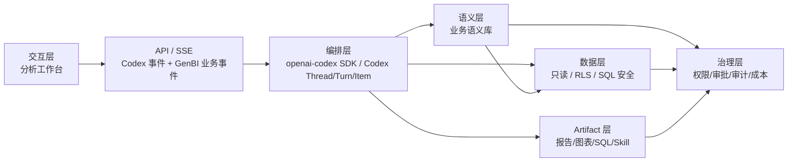

# 架构边界

## 总图



## 分层职责

| 层 | 职责 | 边界 |
| --- | --- | --- |
| 交互层 | 左侧展示分析任务、Agent 过程和追问；右侧展示当前交互式分析结果；“我的分析”展示已保存结果和模板 | 不做真实权限判断，不直接访问生产数据 |
| API / SSE | 接收请求，返回尽量贴近 Codex 原生 `turn/*`、`item/*` 的事件流，并补充 `genbi/*` 业务事件 | 不把 Codex 事件重新翻译成另一套相似 runtime |
| openai-codex SDK / Codex | Thread、Turn、Item、上下文、压缩、Agent Loop、工具调度、模型调用、sandbox、approval、tool/MCP/Skill 编排 | 不自研 Codex 已经提供的通用 Agent 工程能力 |
| 业务语义库 | 提供语义模型和业务知识检索、引用、版本、认证 | 不返回完整敏感业务文件正文 |
| 数据层 | 数据源连接、只读查询、SQL AST 校验、limit、超时、RLS、脱敏、审计 | 不允许浏览器绕过 |
| Artifact 层 | 保存报告、图表、SQL、代码、数据快照、分析路径、`SKILL.md` 和版本 | 不把本地 mock 当真实共享 |
| 治理层 | RBAC/RLS、敏感字段、审批、发布、审计、成本、模型/工具权限 | 横跨所有层 |

## Codex 优先原则

能用 Codex 的，绝不自研。

```text
编排执行：优先通过 openai-codex Python SDK 接 Codex；需要更底层能力时再研究 codex-core。
会话状态：直接使用 Codex Thread / Turn / Item；GenBI 只保存权限归属、索引和业务投影。
工具生态：优先用 Codex tool / MCP / Skills / Apps / Connectors。
执行环境：优先用 Codex shell / apply_patch / sandbox / approval。
检索与版本：优先用 Codex file search / git 工具。
模型调用：优先走 Codex model adapter / client。
```

本项目只做业务层和适配层：业务语义库、数据源安全访问、分析资产治理、前端分析工作台，以及 Codex 与这些业务能力之间的 adapters。

## 最终职责边界

Codex 负责：

- Agent Loop
- Thread
- Turn
- Item
- 上下文
- 上下文压缩
- 工具调度
- 流式执行事件
- 中断和追加指令
- Sandbox / Approval 基础能力

GenBI 负责：

- 用户和租户
- 数据权限
- 数据源
- FineReport 语义案例
- 指标与关联规则
- 受控 SQL 工具
- Artifact
- Artifact 版本和血缘
- 分享、发布和治理

## Codex 适配契约

目标后端不自建通用 runtime，而是提供这些接入 openai-codex SDK / Codex 的稳定适配接口：

```text
ThreadMappingAdapter：把 GenBI 用户、租户、工作空间和权限归属映射到 Codex Thread。
ToolAdapter：把资源库、数据库、业务语义库、Artifact 存储包装成 Codex 可调用工具。
ModelAdapter：优先复用 Codex 模型适配；只在业务需要时补供应商配置。
ArtifactAdapter：把 Codex 产物登记为分析资产、版本、来源 codex_thread/codex_turn/codex_item 和依赖。
EventProjectionAdapter：透传 Codex 事件，并为查询、审计和前端展示保存轻量 projection。
StateAdapter：保存 GenBI Thread 映射和 Codex Item projection，不再扩充自研 Run Runtime。
```

模型供应商只是 adapter。分析任务运行入口统一走 Codex / openai-codex；项目侧只保留业务语义、数据安全、资产治理和 Codex 适配代码。

## 系统对象口径

```text
GenBI Thread：产品入口、权限归属和工作空间映射，基本一对一指向 Codex Thread。
Codex Thread：实际 Agent 会话和上下文来源。
Codex Turn：用户触发的一轮 Agent 工作，从输入到暂停、追问、失败或完成。
Codex Item：Turn 内产生的消息、推理、工具调用、工具结果和模型输出。
GenBI Artifact：可复用分析资产，由 Codex Item 产生或更新，但由 GenBI 负责版本、治理和血缘。
execution_attempt：仅作为内部重试/审计记录存在，不是产品或主领域对象；当前 `Run` API 属于过渡兼容层。
```

产品层继续使用“分析任务 / 分析会话 / 分析资产”；系统层优先对齐 Codex `Thread / Turn / Item`。GenBI 不再扩充自研 `Thread / Turn / Run / Item` runtime。

## 核心事件

Codex 事件是前后端主契约，后端只加 GenBI 权限和业务外壳。目标事件形态优先保留 Codex 原生 `method` 与 `payload.item.id/type`：

```text
turn/started
item/started
item/agentMessage/delta
item/completed
turn/completed
genbi/artifact/created
genbi/artifact/updated
genbi/approval/requested
genbi/dataAccess/denied
```

探索模块的 `run.created` / `run.completed` 事件仅限历史探索能力；分析工作台不再以 Run lifecycle 作为目标契约，外部事件主线是 `turn/*`、`item/*` 和 `genbi/artifact/*`。

所有事件必须有 TypeScript schema；真实 API 建立后用 OpenAPI 或等价 schema 校验。

## 交互式分析结果契约

用户看到的主结果是 `interactive_report`，不是 HTML、PDF 或截图。它以 PostgreSQL `jsonb` 为目标存储形态：

```text
Puck document：组件、布局、组件参数
filters：可交互筛选器定义与默认值
queries：数据集与筛选绑定
chartSpecs：平台级 Chart Spec，前端适配为 ECharts option
gridSpecs：平台级 Grid Spec，前端适配为 AG Grid 配置
```

运行时筛选、分页、排序和缩放存于前端状态，不创建新版本；页面布局、查询、图表/表格配置、结论和默认筛选器变更才创建新的结果版本。

报告读取真实数据时，浏览器只能提交已登记的 `queryRef` 和运行时筛选；SQL 模板、允许筛选键、AST 校验、参数绑定、只读账户、RLS 与审计均属于服务端数据层。首个实现是 FineReport“财务经营管报日报”的渠道销售汇总，尚未具备用户绑定 RLS 与完整审计。

FineReport 的解析详情不能直接进入外部模型。当前分析运行不提供前端逐次授权外发语义摘要的能力；服务端可在业务语义库页面展示解析结果，但不会把原始 SQL、数据源连接、CPT 路径、参数默认值、单元格正文或报表解析摘要作为模型上下文外发。

## 当前实现快照

- 前端：Next.js + TypeScript，`modules/analysis` 已承载左侧分析对话、右侧交互式分析结果、“我的分析”结果列表和业务语义库 mock。
- 后端：FastAPI 已有分析 Thread/Turn API / SSE、资源库工具、数据库只读工具、知识记录、分析资产最小存储；`ThreadStore` 正在收敛为 GenBI Thread 映射 + Codex Item projection，旧 Run 结构仅允许作为内部 execution attempt 兼容投影存在。交互式报告使用 `analysis_reports` 与 `analysis_report_versions` 保存 JSONB 与不可变版本；数据库不可用时仅开发环境回退 JSON 文件，并提供分析 Thread 与报告查询接口；`GENBI_ANALYSIS_RUNTIME=codex` 可切到 openai-codex Python SDK runner。
- 编排：`backend/harness/codex_sdk_runner.py` 是当前分析任务唯一真实 runner；探索侧只保留服务契约和工具函数，后续通过 Codex tools / MCP / Skills 接入。

## Codex 运行配置

```text
GENBI_ANALYSIS_RUNTIME=codex
GENBI_CODEX_PROVIDER=minimax
GENBI_LLM_BASE_URL=https://api.minimaxi.com/v1
MINIMAX_API_KEY=...
```

当 `GENBI_LLM_PROVIDER=minimax` 或 `GENBI_CODEX_PROVIDER=minimax` 时，runner 会把 MiniMax 配成 Codex 自定义 `model_provider`，复用 `MINIMAX_API_KEY` 和 `GENBI_LLM_BASE_URL`。OpenAI/Codex 原生账号可使用 `GENBI_CODEX_API_KEY` 或 `OPENAI_API_KEY`。当前分析 runner 默认使用 read-only sandbox 和 deny-all approval；业务工具接入后再按工具级权限开放。
- 历史知识探索 UI 仍在代码中，但不再是目标主入口。

## 安全底线

- 数据库账号必须只读。
- SQL 必须经过服务端校验，禁止多语句、写操作和无约束大查询。
- RLS、敏感字段、团队权限和审批必须在服务端。
- 前端状态、隐藏按钮、提示词和 mock 标记都不是安全边界。
- 资源库搜索和摘要不返回完整业务文件正文；片段读取必须受控。

## 演进顺序

1. 保留现有 API 兼容层，但停止扩充 GenBI Run Runtime。
2. 把分析任务执行收敛为 GenBI Thread 映射到 Codex Thread；Turn 使用 Codex Turn，Item 使用 Codex Item ID/Type。
3. 前端 SSE 逐步改为消费 Codex `turn/*`、`item/*` 事件和 `genbi/*` 业务事件。
4. 把资源库、数据库、业务语义库改成 Codex tool / MCP / Skill adapters。
5. 把 Artifact 版本、权限、发布、回到任务继续迁入 Codex Item 血缘，再做自动刷新、评估、成本和治理。
