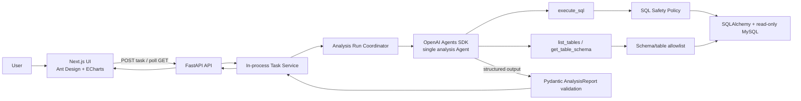
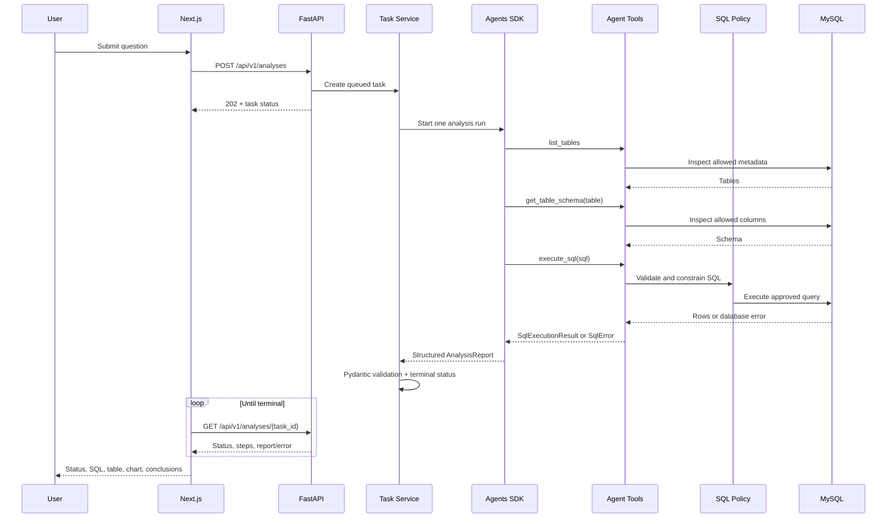
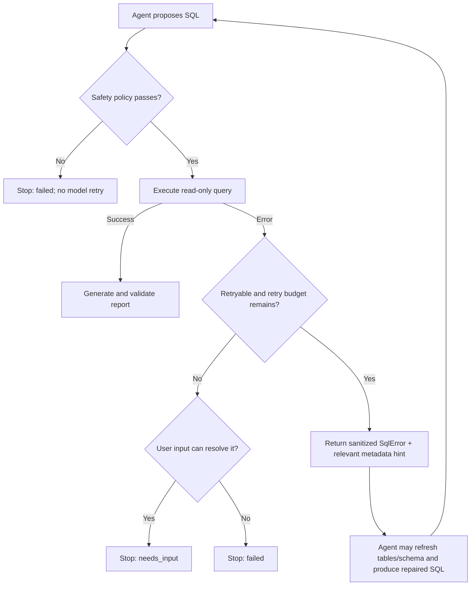

# MVP Architecture Overview

Status: Approved design baseline
Date: 2026-07-14

## Design summary

The MVP is a small frontend/backend application with one analysis Agent and one read-only MySQL data source. FastAPI is the trusted orchestration boundary. The model may propose actions, but deterministic Python code and MySQL permissions decide what can run.

The API uses process-local background tasks and polling. This supports visible execution status without introducing Redis, Celery, SSE recovery, or durable job infrastructure. It deliberately supports one FastAPI process/worker only.

## Overall architecture

## Component responsibilities

### Next.js frontend

- Collect and validate one natural-language question.
- Create an analysis task and poll its status at a bounded interval.
- Render task state and ordered `AgentExecutionStep` entries.
- Render final SQL as text, table rows with Ant Design, and a constrained ECharts option derived locally from `ChartSpec`.
- Render warnings, truncation, user-action errors, and conclusions.
- Never receive database credentials, raw stack traces, model provider secrets, or executable chart code.

### FastAPI

- Validate HTTP requests and serialize the contracts in `interfaces.md`.
- Create a UUID task, store it in the process-local registry, and run one coordinator job.
- Enforce one terminal transition: `succeeded`, `failed`, or `needs_input`.
- Own server configuration, tool-call budget, retry budget, cancellation/timeout mapping, and public error sanitization.
- Validate the final structured Agent output with Pydantic before exposing it.
- Return `404` for unknown/expired task IDs and never claim durability across restarts.

### Analysis run coordinator

- Build the Agent instructions and register exactly three tools.
- Maintain the SQL attempt counter independently of model messages.
- Record each tool call and material state transition as an execution step.
- Route retryable SQL failures back into the same Agent run while budget remains.
- Stop on policy rejection, permission errors, timeouts, missing business context, unsafe requests, or exhausted budgets.
- Persist no data beyond process memory in the MVP; structured logs are emitted for diagnosis.

### OpenAI Agents SDK

- Interpret the question, choose metadata tools, formulate SQL, interpret structured SQL results/errors, and produce a grounded `AnalysisReport` structured output.
- It may not bypass the tool implementations, increase budgets, access environment variables, or execute arbitrary code.
- It is a runtime/orchestration library, not the source of security guarantees.

### Agent tools

- `list_tables`: return only configured, visible tables and optional comments.
- `get_table_schema`: validate the table against the allowlist and return columns/types/nullability/comments.
- `execute_sql`: call the SQL safety policy, run through SQLAlchemy, and always return a typed success or ordinary failure result instead of raising a normal database error into the Agent loop.

The tools contain no presentation logic and do not call the frontend.

### SQL safety layer

- Parse as one MySQL statement and require a read-only query root.
- Reject forbidden AST nodes/constructs, multiple statements, ambiguous parsing, unapproved schemas/tables, locking, file operations, comments used to obscure intent, and data-changing operations.
- Apply a server-controlled row cap and query timeout.
- Preserve the submitted SQL and the normalized/executed SQL for audit.
- Sanitize database errors and classify them as retryable or terminal.
- Never use only regexes or prompt instructions as the security boundary.

### SQLAlchemy and MySQL

- SQLAlchemy manages the connection/pool, metadata inspection, parameter-safe driver calls, timing, and result conversion.
- MySQL stores the test/desensitized business data and enforces final read-only authorization through a restricted account.
- The database user must not have write, DDL, administrative, file, or unrelated schema privileges.

### Report JSON

- It is the stable boundary between analysis execution and presentation.
- It contains grounded conclusions, final executed SQL, tabular data, optional constrained chart metadata, assumptions, and warnings.
- It contains no HTML, ECharts JavaScript option object, callbacks, or arbitrary code.
- Pydantic validates model output; invalid report output fails the task instead of reaching the browser.

## Why `build_report` is not a tool

The MVP does not register `build_report`. Report creation is the Agent's required structured final output (`AnalysisReport`), validated once by Pydantic.

Making it a tool would add a redundant model-to-tool round trip, require the tool to receive potentially large result rows again, and create ambiguity over whether the tool or the Agent owns final completion. A dedicated report service/tool becomes useful only if report generation later becomes deterministic, reusable outside Agent runs, separately authorized, or asynchronous. None of those conditions exists in this MVP.

## Complete request flow

## SQL repair flow

The initial execution is attempt `1`. At most two repairs produce attempts `2` and `3`; `SQL_MAX_RETRIES=2` is enforced by the coordinator, not inferred from the conversation.

Every attempt records original/proposed SQL, policy decision, executed SQL if any, sanitized error, duration, and outcome. The frontend receives safe execution steps; sensitive logs remain backend-only.

## Repairability policy

### Automatically repairable within budget

- Unknown table when refreshing `list_tables` can identify an allowed intended table.
- Unknown column when `get_table_schema` reveals an unambiguous allowed field.
- Alias, quoting, simple MySQL syntax, supported function, aggregate, or `GROUP BY` mistakes.
- Type conversion or date expression mistakes when schema types make the correction unambiguous.

Repair is never automatic when the corrected query changes the user's business meaning rather than syntax/schema alignment.

### Stop as `needs_input`

- The question has multiple materially different interpretations.
- A business metric, time zone, currency, cohort, or comparison baseline is undefined and cannot be inferred safely.
- Required tables/columns are absent or outside the allowlist.
- The result is empty and the system cannot distinguish “no data” from an incorrect filter without user context.
- Multiple candidate tables/fields are equally plausible.

### Stop as `failed`

- SQL policy rejection or an unsafe/user-requested write operation.
- Database permission, connection, or infrastructure failure.
- Query timeout or server resource limit.
- Tool-call, task-time, or retry budget exhaustion.
- Repeated or non-retryable parser/driver errors.
- Model/provider failure or invalid structured report after the allowed runtime policy.

## Security boundaries

Defense is layered:

1. The frontend cannot access MySQL or backend secrets.
2. FastAPI validates input size and controls task/tool/retry budgets.
3. Tools expose only metadata and read-only query operations.
4. The SQL policy parses and constrains every query before execution.
5. SQLAlchemy uses only the configured connection and driver behavior.
6. MySQL privileges enforce read-only access even if an upstream control fails.
7. Responses and logs sanitize secrets and separate public errors from internal diagnostics.

Prompt instructions improve behavior but are not counted as a security control.

## Deployment and operational constraints

- One backend process and one worker only; task registry is not shared.
- A backend restart loses queued/running/completed task records.
- No production availability, durability, authentication, or horizontal scaling claim.
- Development and tests use test/desensitized data only.
- Logs must avoid full row dumps when data sensitivity is unknown.

## Future extension triggers

Add complexity only after measured need:

- Durable queue/storage when tasks must survive restarts or multiple workers are required.
- SSE/WebSocket when polling latency measurably harms usability.
- A semantic layer such as WrenAI when schema comments and prompts cannot express recurring business definitions reliably.
- LangGraph when workflow branching, resumability, human approval checkpoints, or multiple specialized agents become real requirements.
- Multi-database abstractions only after a second verified database use case.
- Authentication/multi-tenancy before access by multiple untrusted users or datasets.

These are extension seams, not current implementation tasks.
