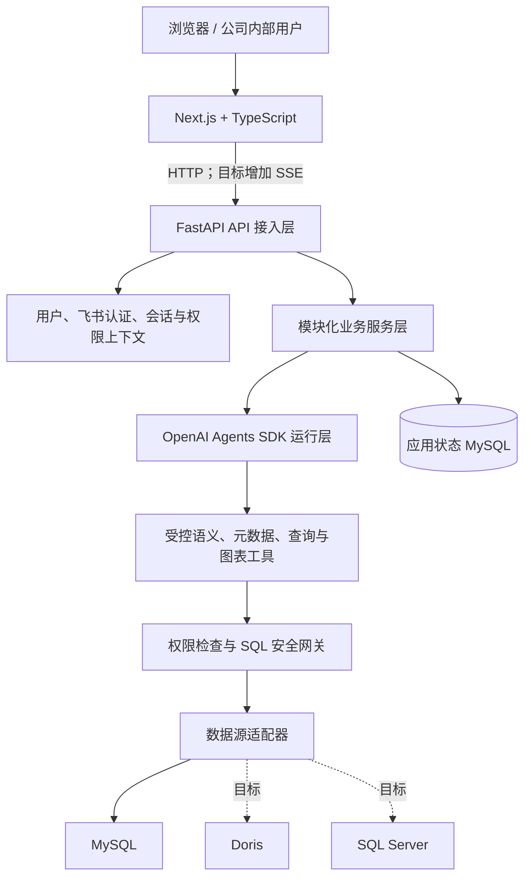

# 架构边界

## 2026-07-20 接口补充：真实用户列表

- 当前新增 `GET /api/v1/users`：要求登录，通过 `agentic_genbi_session` Cookie 解析当前用户；未登录返回 `401 AUTH_REQUIRED`。
- 接口只读应用状态库 `users` 表，返回 `{"users":[{"id","external_subject","display_name","avatar_url","role"}]}`。
- `users.role` 当前只支持 `admin` 与 `user`，默认 `user`；管理员可通过 `PATCH /api/v1/users/{user_id}/role` 修改用户角色，普通用户会被后端拒绝。
- 当前仍不做成员编辑；分析任务读取由后端根据可信 session 用户角色判断：`admin` 可读取全部终态分析列表和单条任务，`user` 仍只能读取自己的任务，越权读取继续返回 `404 TASK_NOT_FOUND`。

## 文档口径

本文同时描述当前实现和已经确认的目标架构。标记规则如下：

- **当前**：仓库中已经实现并验证的能力。
- **目标**：已确认的架构方向，但不代表已经实现或排期。
- **后续**：仅保留扩展边界，进入当前任务前仍需单独确认设计和验收标准。

当目标设计与已验证实现冲突时，以当前实现为准。应用状态数据库当前和可预见阶段继续使用 MySQL，不采用附件方案中的 PostgreSQL；迁移继续使用项目现有的应用启动幂等迁移机制，不切换 Alembic。

## 总体架构



前端只通过 FastAPI 调用系统，不接触数据库凭据或模型密钥。FastAPI 负责 HTTP 契约、身份解析、权限上下文、业务状态、Agent 编排、查询安全、结果校验和错误映射。Agent 只负责推理、规划、工具调用和结构化输出，不能直接连接数据库，也不能把提示词当作安全边界。

系统第一阶段采用模块化单体：一个 FastAPI 应用、清晰的模块边界、一个应用状态 MySQL，以及通过统一接口访问的业务数据源。只有出现明确的性能、部署或团队协作瓶颈后才拆分服务。

## 分层与模块职责

| 层 | 当前职责 | 目标扩展 |
| --- | --- | --- |
| Next.js 前端 | 登录、提交问题、轮询任务、展示 SQL、表格、图表描述和报告 | 持续对话、SSE、Monaco SQL 工作区、ECharts、分析资产、仪表板、团队与管理界面 |
| FastAPI 接入层 | API、请求校验、Cookie 会话、用户解析、统一错误 | SSE 输出、细粒度权限上下文和更多业务路由 |
| 业务服务层 | 用户/认证、持久化分析任务与所有者隔离 | Conversation、Artifact、Dashboard、Team、Permission、Semantic Model、Data Source、Audit |
| Agent 运行层 | 主 Agent、受控工具调用、SQL 生成与有限修复、结构化报告 | 语义理解、查询规划、结果校验、图表规划、持续追问与阶段回退 |
| 受控工具层 | 元数据、SQL AST 校验、表白名单、查询执行 | 语义工具、字段与数据范围权限、Query Rewriter、结果校验、ChartSpec 校验 |
| 数据访问层 | MySQL 只读连接 | 统一 MySQL、Doris、SQL Server 适配器；后续保留联邦查询规划接口 |

## 核心分析流程

目标分析链路为：

```text
用户消息
→ 创建或继续 Conversation
→ 创建 Analysis Run
→ 生成 SemanticIntent
→ 查询语义模型与元数据
→ 生成 QueryPlan
→ 校验数据与功能权限
→ 生成数据库方言 SQL
→ SQL 解析、重写和安全校验
→ 只读执行与有限自动修复
→ 校验结果
→ 生成 AnalysisReport 与 ChartSpec
→ 更新可继续追问的 Analysis State
→ 用户确认后保存 Analysis Artifact
```

当前已经实现从单次问题到持久化 `AnalysisReport` 的主要查询链路，但尚未实现 `Conversation`、`SemanticIntent`、显式 `QueryPlan`、可恢复 `Analysis State` 和 `Analysis Artifact`。

### 目标阶段回退

- 数据范围、指标或筛选变化：回到语义理解或查询规划阶段。
- SQL 执行失败：返回结构化错误，重新查询必要元数据，最多按配置修复两次，并且每次都重新经过安全校验。
- 仅修改图表：复用现有查询结果，只回到图表规划和渲染阶段。
- 手动刷新资产：优先复用上次 SQL；权限或 schema 不再满足时，由 Agent 重新规划。

## Agent 运行层

第一阶段保持一个主 Agent 加多个受控工具，不急于拆分多个 Agent。当前能力与目标增强如下：

- **Agent Runtime（当前基础，目标增强）**：当前启动单次分析并管理工具调用、公开步骤和有限重试；目标增加会话、细粒度权限、可恢复分析状态、模型消耗、耗时和 tracing 上下文。
- **Semantic Understanding（目标）**：输出结构化 `SemanticIntent`，识别指标、维度、时间、筛选、排序、Top N 和对比要求。
- **Query Planning（目标）**：选择数据源、语义模型、表和关联路径，输出结构化 `QueryPlan`。
- **SQL Generation（当前）**：根据上下文生成 SQL；目标支持 MySQL、Doris 和 SQL Server 方言。
- **SQL Repair（当前）**：根据结构化错误查询元数据并有限修复，不能绕过查询安全层。
- **Result Validation（当前基础，目标增强）**：当前用 Pydantic 校验报告结构，并保证图表字段引用结果表列；目标增加空结果、异常值、聚合粒度、对原始问题的满足程度和是否需要补充查询的语义检查。
- **Chart Planning（目标）**：输出稳定的 `ChartSpec`，不直接生成完整 ECharts `option`。
- **Insight Generation（当前）**：生成趋势、异常、对比和不确定性说明，不引用用户无权限的数据。

## 语义模型

语义模型负责把数据库技术字段转换为统一业务口径，由以下对象组成：

```text
Semantic Model
├── Metric
├── Dimension
├── Field Metadata
├── Join Relationship
└── Business Glossary
```

第一阶段目标只覆盖模型、指标、维度、字段说明和表关联关系。核心指标表达式由语义模型定义；Agent 可以选择指标和筛选条件，但不能临时修改核心公式。权限元数据可以挂接到模型、指标、字段和数据范围，但具体授权仍由后端权限模块执行。

## 查询、安全与数据源

### 查询安全流水线

无论 SQL 来自 Agent 还是高级用户手工修改，都必须经过同一条受控链路：

```text
SQL 解析
→ 只读与单语句检查
→ 表、字段和危险表达式检查
→ 数据源、模型、指标、字段与数据范围权限检查
→ 必要的数据范围和强制 LIMIT 重写
→ 行数、超时和查询成本限制
→ 只读连接执行
→ 结构化结果或结构化错误
```

当前安全边界：

- 仅允许一条 `SELECT`，或以 `WITH` 开始且最终为查询的语句。
- 拒绝写入、DDL、管理语句、多语句、注释绕过和未授权表。
- 使用 SQLGlot 解析 AST，并强制全局表白名单、最大返回行数、查询超时、工具调用上限和 SQL 修复上限。
- Python 校验与数据库只读权限必须同时保留；提示词不是安全边界。
- 日志与公开响应不得泄露凭据、OAuth token、会话值、原始数据库错误或不必要的敏感结果。

字段权限、数据范围注入、危险函数限制、查询成本检查和高级用户 SQL 编辑尚未实现，进入开发前必须补充拒绝用例。

### 数据源适配器

目标统一接口包括：

```text
test_connection()
get_schema()
execute_query()
explain_query()
cancel_query()
```

当前仅有 MySQL 查询链路。目标实现 `MySQLAdapter`、`DorisAdapter` 和 `SQLServerAdapter`，统一返回结构化元数据、查询结果和错误。跨数据源分析只保留 `FederatedQueryPlanner` 扩展边界，第一阶段不做应用层跨库 Join。

## 图表

目标职责分离为：Agent 决定画什么，ECharts 决定如何渲染。

```text
Agent
→ ChartSpec
→ Chart Validator
→ ECharts Adapter
→ ECharts option
→ 前端渲染
```

`ChartSpec` 至少描述图表类型、标题、类别字段、系列字段和格式。`Chart Validator` 校验字段存在性、字段类型、图表类型、类别数量、敏感字段和 Top N；`ECharts Adapter` 统一主题、颜色、Tooltip、Legend、坐标轴、响应式布局以及金额和百分比格式。

当前后端已经有服务器拥有的基础 `ChartSpec` 数据结构，并校验图表字段必须引用结果表列；前端仍使用简单原生图表渲染。通用 `Chart Validator`、ECharts Adapter 和 ECharts 渲染尚未实现。

## 会话、运行状态与分析资产

### Conversation 与 Analysis Run

- `Conversation` 表示持续分析过程，保存标题、创建人、消息、当前分析状态、当前数据源和当前资产引用。
- `Message` 目标类型包括 `user`、`assistant`、`system`、`tool` 和 `error`。
- `Analysis Run` 表示会话中的一次执行，保存输入、语义意图、查询计划、SQL、工具调用、结果引用、图表、结论、错误、重试、模型消耗、耗时和状态。
- `Analysis State` 保存可被下一轮增量修改的 `semantic_intent`、`query_plan`、`sql`、`result_ref`、`chart_spec` 和 `summary`。

当前 `analyses` 与 `analysis_steps` 已持久化单次任务及公开步骤，并按 `owner_user_id` 隔离；它们是后续演进为会话和运行模型的现有基础，不应被文档描述为完整 Conversation 模型。

### Analysis Artifact

`Analysis Artifact` 表示用户确认并保存的可复用结果，目标保存原始问题、`QueryPlan`、SQL、结果快照、`ChartSpec`、结论、数据源引用、语义模型版本、创建人、当前版本和分享设置。版本和快照是资产的一部分；刷新或编辑生成新版本，不覆盖历史结果。

会话和资产必须分离：Conversation 记录探索过程，Artifact 记录稳定结果。

## 仪表板、团队与分享

- `Dashboard` 目标类型为 `personal` 和 `team`。
- `Dashboard Card` 引用分析资产和展示版本，只保存标题、布局、尺寸和图表覆盖配置，不复制 SQL 与完整分析逻辑。
- `Team` 和成员关系在应用内部维护；飞书只负责登录，不同步组织架构。
- 目标团队角色为 `team_admin`、`team_editor`、`team_member`。
- 分享权限目标包括查看、刷新、编辑和再分享；每项授权必须由后端校验，不能依赖前端隐藏按钮。

这些模块当前尚未实现。

## 权限与认证

### 认证边界（当前）

- 飞书 OAuth 回调只在后端处理；应用密钥只存在于运行环境。
- OAuth state 写入应用状态 MySQL，只能使用一次，并受短 TTL 约束。
- `FRONTEND_BASE_URL` 是受配置约束的公开前端地址：后端使用它处理 OAuth 回跳和 CORS，前端容器也使用同一值生成服务端表单提交后的跳转地址；不从请求 Host 推导目标地址。
- 浏览器使用 HttpOnly、SameSite=Lax 的 `agentic_genbi_session` Cookie 标识会话。
- 身份只能由后端根据 Cookie 和 `sessions` 表解析；客户端提交的 `user_id`、角色或所有者不可信。
- 分析任务创建和读取要求登录，并按 `owner_user_id` 隔离；不存在和非所有者统一返回 `404 TASK_NOT_FOUND`。

### 目标授权模型

- 系统角色：普通用户、高级用户、系统管理员。
- 功能权限：SQL 查看/编辑/执行，资产、仪表板、团队、数据源、语义模型和用户管理。
- 数据权限：数据源、语义模型、指标、字段和数据范围。
- 普通用户可查看 SQL，不可手工修改和执行；高级用户可编辑和重新执行，但仍必须通过完整安全网关。

权限判定必须由后端基于可信身份和服务器端授权数据完成。

## 审计与软删除

目标审计事件包括登录、提问、SQL 生成或修改、SQL 执行、权限拒绝、数据源访问、资产分享、仪表板修改、删除和恢复。审计记录至少包含 `user_id`、`action`、资源类型和 ID、`request_id`、`sql_hash`、`datasource_id`、结果状态和时间；敏感 SQL 只保存脱敏值或哈希。

目标对分析资产、仪表板、卡片、团队和语义模型采用软删除，记录删除人、原因、时间和清理时间。默认保留 30 天是目标策略，尚未实现。

## 数据存储

### 应用状态 MySQL：`APP_DATABASE_URL`

- 本地默认与分析库共享一个 MySQL 服务，但使用独立的 `agentic_genbi_app` schema、连接串和可写账号；部署时可以把该连接串指向独立 MySQL 服务。
- 当前保存 `users`、`sessions`、`oauth_states`、`analyses`、`analysis_steps` 和迁移版本。
- 当前迁移版本为 `0001_initial_users_sessions`、`0002_oauth_states` 和 `0003_analyses`，在 FastAPI 生命周期启动时幂等执行。
- 后续在同一应用状态 MySQL 中保存会话、消息、资产、版本、仪表板、团队、权限、语义模型、数据源配置和审计日志。
- 应用账号不得获得分析 schema 权限；Agent 工具链不得直接连接应用状态库。

### 分析数据：`DATABASE_URL`

- 当前仅由元数据工具和 `execute_sql` 使用 MySQL 只读账号。
- 当前不再使用 `ALLOWED_TABLES` 做表级白名单限制；现阶段只保留“只读 SQL + 单语句 + 行数上限”这类运行时安全边界，后续再单独实现权限控制。
- 不保存用户、会话、资产或系统状态。
- 目标通过独立连接配置接入 MySQL、Doris 和 SQL Server。

### 对象存储与 Redis

第一阶段不引入对象存储和 Redis。小型结果快照可保存在应用状态 MySQL 的 JSON 列；只有结果规模证明有必要时，才引入 MinIO 等对象存储。Redis 仅在出现明确的会话缓存、SSE 状态、分布式锁、结果缓存或限流需求后评估。

## 公开接口与错误约定

| 接口 | 当前约定 |
| --- | --- |
| `GET /health` | 返回 API 进程健康状态。 |
| `POST /api/v1/analysis-tasks` | 要求登录，创建持久化分析任务并返回 `202`。 |
| `GET /api/v1/analysis-tasks` | 要求登录，仅返回当前用户已结束任务的摘要（成功、失败、待补充信息），按完成时间倒序；完整报告需通过单任务接口读取。 |
| `GET /api/v1/analysis-tasks/{task_id}` | 要求登录，只读取当前用户的任务；不存在和非所有者统一返回 `404 TASK_NOT_FOUND`。 |
| `GET /api/v1/auth/login` | 创建一次性 OAuth state 后跳转飞书；缺少配置时返回 `503 FEISHU_AUTH_NOT_CONFIGURED`。 |
| `GET /api/v1/auth/callback` | 消费 state、交换飞书身份、创建会话后跳回前端；非法 state 返回 `401 OAUTH_STATE_INVALID`，交换失败返回 `502 FEISHU_EXCHANGE_FAILED`。 |
| `GET /api/v1/auth/me` | 返回当前用户；缺失、无效或过期会话返回 `401 AUTH_REQUIRED`，过期 session 会被删除。 |
| `POST /api/v1/auth/logout` | 删除当前会话并清除 Cookie。 |

业务错误统一使用 `{"error":{"code":"...","message":"..."}}`。公开响应不得包含 OAuth token、会话值、原始数据库错误或模型内部推理。创建任务后，前端只在 `queued` 或 `running` 状态轮询，不因网络失败自动重建任务。

## 技术选型与演进约束

| 范围 | 当前 | 目标或后续 |
| --- | --- | --- |
| 前端 | Next.js、TypeScript、Vitest | ECharts、Monaco Editor、SSE |
| 后端 | FastAPI、Pydantic、SQLAlchemy、pytest | 保持模块化单体；按实际瓶颈再拆分 |
| Agent | OpenAI Agents SDK，当前使用 MiniMax OpenAI 兼容端点 | 模型供应商与业务模块解耦 |
| SQL | SQLGlot、MySQL 只读执行 | Doris、SQL Server 方言与适配器 |
| 应用状态 | MySQL、应用启动幂等迁移 | 继续使用 MySQL；不迁移 PostgreSQL/Alembic |
| 部署 | Docker Compose | 只有明确部署需求后再评估 Kubernetes |

业务模块应通过稳定接口与图表库、模型供应商、数据库驱动和 Agent 编排框架解耦，但不为尚未出现的替换需求过度抽象。

## 第一阶段架构非目标

- 多 Agent、微服务和 Kubernetes。
- 应用层跨数据源 Join。
- 定时刷新、通用任务调度和可靠队列。
- 公司级公共仪表板、告警中心和审批流。
- 复杂指标版本、数据血缘和复杂字段级权限配置后台。
- 未有规模证据时引入 Redis、对象存储或新的系统数据库。

当系统复杂度、技术约束、公开接口、数据模型、安全边界、运行配置或部署方式变化时更新本文档；当前工作状态和切片计划写入 [`../plans/current.md`](../plans/current.md)。
