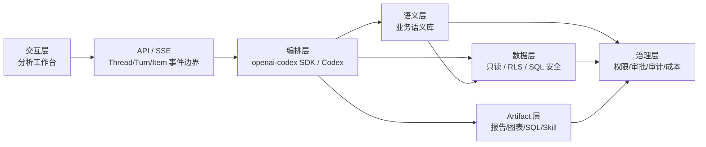

# 架构边界

## 总图



## 分层职责

| 层 | 职责 | 边界 |
| --- | --- | --- |
| 交互层 | 展示分析任务、Agent 过程、追问、当前任务资产、资产库和语义库 | 不做真实权限判断，不直接访问生产数据 |
| API / SSE | 接收请求，返回 Thread/Turn/Item 事件流，隔离前后端契约 | 不泄漏内部工具实现 |
| openai-codex SDK / Codex | 规划、执行、反思、上下文组装、工具调度、模型调用、sandbox、approval、tool/MCP/Skill 编排 | 不自研 Codex 已经提供的通用 Agent 工程能力 |
| 业务语义库 | 提供语义模型和业务知识检索、引用、版本、认证 | 不返回完整敏感业务文件正文 |
| 数据层 | 数据源连接、只读查询、SQL AST 校验、limit、超时、RLS、脱敏、审计 | 不允许浏览器绕过 |
| Artifact 层 | 保存报告、图表、SQL、代码、数据快照、分析路径、`SKILL.md` 和版本 | 不把本地 mock 当真实共享 |
| 治理层 | RBAC/RLS、敏感字段、审批、发布、审计、成本、模型/工具权限 | 横跨所有层 |

## Codex 优先原则

能用 Codex 的，绝不自研。

```text
编排执行：优先通过 openai-codex Python SDK 接 Codex；需要更底层能力时再研究 codex-core。
会话状态：对齐 Codex Thread / Turn / Item。
工具生态：优先用 Codex tool / MCP / Skills / Apps / Connectors。
执行环境：优先用 Codex shell / apply_patch / sandbox / approval。
检索与版本：优先用 Codex file search / git 工具。
模型调用：优先走 Codex model adapter / client。
```

本项目只做业务层和适配层：业务语义库、数据源安全访问、分析资产治理、前端分析工作台，以及 Codex 与这些业务能力之间的 adapters。

## Codex 适配契约

目标后端不自建通用 runtime，而是提供这些接入 openai-codex SDK / Codex 的稳定适配接口：

```text
RunContextAdapter：把用户、thread、turn、权限、模式、业务上下文映射给 Codex。
ToolAdapter：把资源库、数据库、业务语义库、Artifact 存储包装成 Codex 可调用工具。
ModelAdapter：优先复用 Codex 模型适配；只在业务需要时补供应商配置。
ArtifactAdapter：把 Codex 产物登记为分析资产、版本、来源 thread/turn/run 和依赖。
EventAdapter：把 Codex items/events 转成现有 HTTP/SSE 事件。
StateAdapter：把 Codex Thread / Turn / Item 映射到项目的 Postgres ThreadStore。
```

模型供应商只是 adapter。分析任务运行入口统一走 Codex / openai-codex；项目侧只保留业务语义、数据安全、资产治理和 Codex 适配代码。

## 系统对象口径

```text
Thread：持续工作上下文，对应产品层的分析任务、探索任务或资产继续编辑任务。
Turn：用户触发的一轮 Agent 工作，从输入到暂停、追问、失败或完成。
Run：一次实际执行尝试；一个 Turn 可有多个 Run，用于重试、回放或多 Agent 并行。
Item：Turn 内产生的结构化单元，包括 message、tool_call、tool_result、plan、question、artifact、sql、chart、report。
Artifact：可复用分析资产，是可治理的 Item 子集。
```

产品层继续使用“分析任务 / 分析会话 / 分析资产”；系统层、存储层、审计层和 Harness 层统一使用 `Thread / Turn / Item`。

## 核心事件

Thread/Turn/Item 事件是前后端主契约。现阶段事件名保持兼容，后续逐步补齐 `thread_id`、`turn_id`、`run_id`、`item_id`：

```text
run.created
run.plan.updated
agent.message.delta
agent.message.created
agent.question.requested
tool.call.started
tool.call.completed
tool.call.failed
agent.evidence.available
artifact.created
artifact.updated
run.completed
run.failed
```

所有事件必须有 TypeScript schema；真实 API 建立后用 OpenAPI 或等价 schema 校验。

## 当前实现快照

- 前端：Next.js + TypeScript，`modules/analysis` 已承载分析工作台、当前任务资产、独立分析资产库 mock 和业务语义库 mock。
- 后端：FastAPI 已有分析 Run API / SSE、资源库工具、数据库只读工具、知识记录、分析资产最小存储；分析任务已写入新的 `ThreadStore`，保存 Thread/Turn/Run/Item，数据库配置可用时使用 Postgres 表，无数据库时回退 JSONL，并提供分析 Thread 查询接口；`GENBI_ANALYSIS_RUNTIME=codex` 可切到 openai-codex Python SDK runner。
- 编排：`backend/harness/codex_sdk_runner.py` 是当前分析任务唯一真实 runner；探索侧只保留服务契约和工具函数，后续通过 Codex tools / MCP / Skills 接入。

## Codex 运行配置

```text
GENBI_ANALYSIS_RUNTIME=codex
GENBI_CODEX_PROVIDER=minimax
GENBI_LLM_BASE_URL=https://api.minimaxi.com/v1
MINIMAX_API_KEY=...
```

当 `GENBI_LLM_PROVIDER=minimax` 或 `GENBI_CODEX_PROVIDER=minimax` 时，runner 会把 MiniMax 配成 Codex 自定义 `model_provider`，复用 `MINIMAX_API_KEY` 和 `GENBI_LLM_BASE_URL`。OpenAI/Codex 原生账号可使用 `GENBI_CODEX_API_KEY` 或 `OPENAI_API_KEY`。当前分析 runner 默认使用 read-only sandbox 和 deny-all approval；业务工具接入后再按工具级权限开放。
- 历史知识探索 UI 仍在代码中，但不再是目标主入口。

## 安全底线

- 数据库账号必须只读。
- SQL 必须经过服务端校验，禁止多语句、写操作和无约束大查询。
- RLS、敏感字段、团队权限和审批必须在服务端。
- 前端状态、隐藏按钮、提示词和 mock 标记都不是安全边界。
- 资源库搜索和摘要不返回完整业务文件正文；片段读取必须受控。

## 演进顺序

1. 先通过 openai-codex Python SDK 接入 Codex，把 `backend/harness/` 收敛为 Codex adapters，而不是自研 runtime。
2. 把分析任务执行迁到 Codex SDK runner，同时保持现有 HTTP/SSE 契约。
3. 把资源库、数据库、业务语义库改成 Codex tool / MCP / Skill adapters。
4. 把 Artifact 版本、权限、发布、回到任务继续迁入新的 Thread/Item 血缘。
5. 再做自动刷新、评估、成本和治理。
