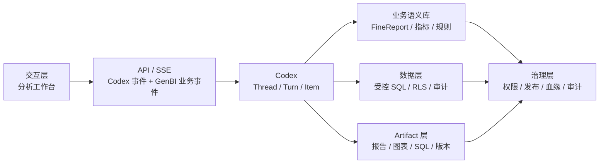

# 架构边界

## 总图



## 最终职责边界

Codex 负责：

- Agent Loop
- Thread
- Turn
- Item
- 上下文
- 上下文压缩
- 工具调度
- 流式执行事件
- 中断和追加指令
- Sandbox / Approval
- 失败、重试和内部请求尝试

GenBI 负责：

- 用户和租户
- 数据权限
- 数据源
- FineReport 语义案例
- 指标与关联规则
- 受控 SQL 工具
- Artifact
- Artifact 版本和血缘
- 分享、发布和治理

## 系统对象口径

```text
Analysis Task：GenBI 的业务任务记录，保存用户、租户、工作空间、标题、权限归属和 codexThreadId。
Codex Thread：真实 Agent 任务线程、上下文和压缩状态。
Codex Turn：用户触发的一轮 Agent 工作。
Codex Item：Turn 内的消息、推理、工具调用、工具结果、模型输出和产物。
GenBI Artifact：可复用分析资产，由 Codex Item 产生或更新。
Artifact Version：Artifact 的不可变版本。
Artifact Lineage：Artifact / Version 与 Codex Thread / Turn / Item 的来源关系。
```

Analysis Task 不是自研执行层；它只是业务归属和 Codex Thread 指针。

## API / SSE 契约

分析工作台 API 只围绕分析主线：

```text
/api/analysis/threads
/api/analysis/threads/{thread_id}
/api/analysis/threads/{thread_id}/turns
/api/analysis/threads/{thread_id}/turns/{turn_id}
/api/analysis/threads/{thread_id}/turns/{turn_id}/events
/api/analysis/assets
/api/analysis/reports
/api/analysis/artifact-lineage
```

事件主线：

```text
turn/started
turn/completed
item/started
item/completed
item/agentMessage/delta
genbi/artifact/created
genbi/artifact/updated
genbi/dataAccess/denied
genbi/approval/requested
```

失败仍使用原生终态事件：turn/completed 携带 status: failed 和 error；Item 失败使用 item/completed 携带 status: failed。系统不创建额外的失败生命周期事件。

每个事件必须包含 `eventSource`：

```text
codex：真实 Codex 通知。
genbi_projection：GenBI 为展示、审计或业务治理补充的投影事件。
```

## Artifact Lineage

Artifact source / lineage 只使用：

```text
artifactId
artifactVersionId
codexThreadId
codexTurnId
codexItemId
```

`artifactId` 表示 Artifact 本体，`artifactVersionId` 表示具体不可变版本。多版本必须共享同一个 `artifactId`。

## 安全底线

- 数据库账号必须只读。
- SQL 必须经过服务端校验，禁止多语句、写操作和无约束大查询。
- RLS、敏感字段、团队权限和审批必须在服务端。
- 前端状态、隐藏按钮、提示词和 mock 标记都不是安全边界。
- FineReport 解析详情不能直接作为外部模型上下文；可进入模型的内容必须先经过受控语义工具裁剪和权限判断。

## 演进顺序

1. 让分析服务主路径对齐 Codex Thread / Turn / Item。
2. 让 Artifact source 和 lineage 只依赖 Codex lineage。
3. 未来的数据访问和业务语义能力只通过受控 Codex tools / MCP / Skill adapters 接入，不恢复旧资源库或报告查询执行层。
4. 完成用户、租户、RLS、分享、发布、治理和审计。
