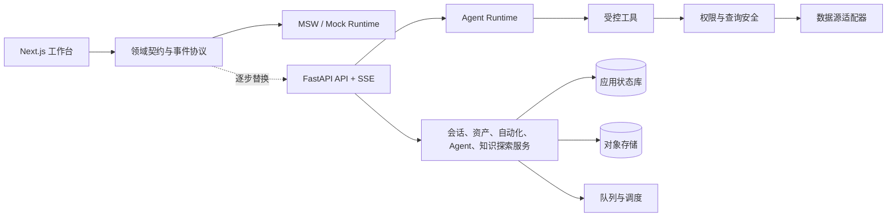

# 架构边界

## 当前实现

当前仓库是前端 only、mock-first 的 Next.js 原型。

- `frontend/src/app/page.tsx` 挂载分析工作台。
- `modules/analysis` 提供会话 UI、mock Agent 客户端、Run 事件折叠、Artifact mock 与图表展示。
- `modules/investigation` 提供知识探索 UI、领域类型、探索过程事件映射和运行环境状态提示；提交探索问题时调用配置的后端 API，服务未配置或失败时明确显示后端不可用，不再模拟探索结果。
- `ChartSpec -> ECharts` 是当前图表渲染链路。
- `backend/resource_library` 提供本地资源库扫描器和结构摘要器，生成被 Git 忽略的资源索引 JSON 与结构摘要 JSON；当前只记录文件元信息、类型、大小、修改时间、hash、XML 标签计数、候选参数/数据集、SQL 读写表、输出字段和表达式候选等结构信号，不展示完整业务正文。
- `backend/resource_library/exploration_agent.py` 提供 OpenAI Agents SDK 适配层：把资源库工具、数据库只读工具和本地知识沉淀包装成 Knowledge Exploration Agent 的 function tools；未安装 SDK 时返回明确依赖错误。
- `backend/resource_library/knowledge_store.py` 保留最小本地知识沉淀 JSONL 存储作为测试与离线开发存储；Docker 真实后端默认通过 `backend/persistence/postgres_stores.py` 写入 PostgreSQL。
- `backend/exploration/run_service.py` 提供探索 Run 事件服务，当前可按统一事件契约产生标题、消息、工具调用、折叠证据、追问和完成事件；也可注入真实 Agent Runner，并为 SSE 提供 async streaming 路径。
- `backend/exploration/run_trace_store.py` 和 `backend/exploration/run_event_store.py` 保留最小本地 JSONL 存储作为测试与离线开发存储；Docker 真实后端默认通过 `backend/persistence/postgres_stores.py` 把探索 Run trace、Run events 和知识沉淀写入 PostgreSQL。
- `backend/exploration/agent_runner.py` 提供 `LLMAgentRunner` 适配器；通过 `GENBI_EXPLORATION_RUNTIME=openai` 或 `llm` 启用，默认 provider 是 OpenAI，也可用 `GENBI_LLM_PROVIDER=minimax` 走 OpenAI-compatible endpoint；支持 `GENBI_EXPLORATION_MODEL`、`GENBI_EXPLORATION_MAX_TURNS` 和 `Runner.run_streamed()` 事件实时转发。
- `backend/config/env.py` 负责加载项目 `.env` 或 `GENBI_ENV_FILE` 指向的 env 文件；LLM provider key、模型配置和 MySQL 连接信息均从 env 读取。MySQL 可使用 `GENBI_DB_*` 专用字段，也可从 `DATABASE_URL=mysql+pymysql://...` 解析，专用字段优先；`doctor` 用于确认 LLM Runner、MySQL 只读连接、资源库、前端 API 地址和成本估算配置是否就绪。
- `backend/api/exploration_api.py` 提供 FastAPI 入口，暴露健康检查、运行环境状态、探索过程/SSE、兼容 Run API、资源库状态/搜索/详情/重建索引、知识列表/保存/删除/清空接口；开发期允许 `localhost:3000`、`127.0.0.1:3000` 以及环境变量声明的前端来源跨域访问，启动前需要安装 `backend/requirements.txt`。
- 前端已接入 Auth.js v5：`frontend/src/auth.ts` 使用自定义飞书 OAuth provider，读取 `FEISHU_APP_ID`、`FEISHU_APP_SECRET` 和 `AUTH_*` 环境变量；`frontend/src/app/api/auth/[...nextauth]/route.ts` 暴露 Auth.js 路由；首页未登录时展示飞书登录页，登录后进入工作台。
- Auth 状态使用 Prisma + PostgreSQL DB session：`frontend/prisma/schema.prisma` 定义 Auth.js `User`、`Account`、`Session` 和 `VerificationToken` 表，迁移文件位于 `frontend/prisma/migrations/`。`User.role` 先保留为最小角色字段，默认 `user`。
- 知识探索前端会从 Auth session 取得 `session.user.id`，请求探索任务列表与创建过程消息时传递 `user_id`；后端探索列表 API 支持按 `user_id` 过滤，用于当前 demo 的多用户探索列表隔离。
- Docker Compose 启动前端、知识探索后端与 Postgres：前端宿主机端口为 `3000`，后端宿主机端口为 `8000`，Postgres 宿主机端口为 `5432`；前端容器启动时执行 `npm install && npm run prisma:migrate && npm run dev`，后端容器挂载当前 `backend/` 代码、只读 `资源库/` 和本地 `.resource-index/`，并默认设置 `GENBI_PERSISTENCE=postgres`。

未包含完整会话/Artifact 持久化、团队级权限、数据权限、前端到完整真实 Agent Runtime 的连接、生产数据源适配器或调度服务。

## 目标形态

本项目采用 **vibe coding** 的开发方式：用户持续给出产品方向和体验反馈，多个 AI 开发 Agent 快速实现可运行 Demo 并根据反馈演进。技术架构因此采用前端优先的模块化单体：先让前端与虚拟后端共享稳定领域契约，后续用真实后端逐项替换 mock 实现。当前不预设微服务拆分。

快速迭代不改变工程底线：mock 只用于验证体验和边界，不能伪装为真实能力；领域类型、HTTP/SSE 事件 schema、测试和服务端安全边界必须随功能演进保持一致。



## 前端架构

一级导航遵循产品入口：`workbench`、`conversations`、`knowledge-exploration`、`agent-center`、`system`。横向能力不强行变成一级导航：

- `Artifact Studio` 从会话右侧资产栏和 Artifact 详情页进入，提供预览、编辑、版本、依赖、引用和自动化入口。
- `Automation Studio` 是 Artifact 或 Agent 的配置与运行历史视图。
- `Agent Studio` 是 Agent 中心内从 Run / Artifact 提炼、编辑、测试和发布 Agent 的工作区。

前端目标依赖：

| 领域 | 技术选择 |
| --- | --- |
| 应用 | Next.js、React、TypeScript |
| 服务端状态 | TanStack Query |
| UI 状态 | Zustand |
| 虚拟后端 | MSW + 本地 mock Runtime |
| 图表 | ChartSpec + ECharts |
| SQL 与代码编辑 | Monaco Editor |
| 资产关系图与 Agent 工作流 | React Flow |
| 测试 | Vitest、Playwright、MSW contract tests |

页面和组件只依赖领域类型与 API Service；mock 与真实服务返回相同的 HTTP/SSE 结构，不将 mock 脚本细节泄漏到 UI。

知识探索不是“指标库优先”的页面，而是 BI 调查工作区：左二栏承载我的探索、资源库和知识沉淀；主区在选择探索任务时呈现一个探索过程。该过程由知识探索 Agent 驱动，以消息流展示检索过程、追问、证据折叠块和可沉淀结论。当前知识探索只沉淀为知识，不直接生成 Artifact 或可复用 Agent。语义定义是其中一项受控上下文能力。

前端知识探索通过 `NEXT_PUBLIC_GENBI_API_BASE_URL` 接入真实探索 API；未配置或请求失败时明确显示后端不可用，不再生成本地模拟探索过程。前端创建探索或继续追问时优先调用 `POST /api/explorations/conversations/stream` 并按 SSE event 增量更新当前探索过程；失败时回退到一次性 `POST /api/explorations/conversations`，再失败则展示错误状态。登录态存在时，探索列表与新建消息会携带当前 Auth session 的用户 ID；这只隔离当前探索列表，不替代服务端数据权限。旧的 `/api/explorations/runs/*` 仍保留为兼容和内部排查入口。

前端知识探索还会读取 `GET /api/runtime/status`，把 env doctor 的结果呈现为标题区运行状态：后端未连接、后端已连接但配置待补、或关键配置已就绪。这个状态只用于开发期可见性，不替代服务端鉴权、审计或生产可观测性。

资源库和知识沉淀也通过同一后端接入：前端启动后会尝试调用 `GET /api/resources/status`、`GET /api/resources/search` 和 `GET /api/knowledge`；失败时可保留静态演示列表，但探索过程本身不再使用本地模拟结果。探索过程中的“沉淀为知识”会把用户问题、结论、范围和证据引用整理后调用 `POST /api/knowledge`；后端失败时应显示失败状态，不伪造成已沉淀。资源库重建由 `POST /api/resources/reindex` 执行，默认读取 `GENBI_RESOURCE_LIBRARY_ROOT` 或项目 `资源库/`。资源详情页可通过 `GET /api/resources/{resource_id}` 查看结构摘要分组，并通过 `GET /api/resources/{resource_id}/excerpt` 读取受控片段；服务端限制 section、行数和字节数，不提供完整文件浏览。结构摘要会把 FineReport 参数、数据集、读写表、输出字段、表达式候选，以及 Apache Hop 节点、读写表和字段候选作为可搜索信号。

资源库后端从本地索引器、结构摘要器和受控资源工具起步：扫描 allowlist 根目录，默认识别 `.cpt`、`.frm`、`.hpl`、`.hwf`、`.sql`、`.xml`、文档和样例数据等文件类型。索引与摘要文件仅作为本地运行产物，不提交 Git。Agent 和前端只通过 `search_resources`、`inspect_resource` 和 `read_resource_excerpt` 访问资源；搜索和摘要不返回完整正文，片段读取必须限定资源、字节数和行数。

数据库探索从只读工具起步：`search_db_tables` 和 `get_table_schema` 查询 `information_schema`，`run_readonly_query` 默认开启但可通过配置关闭。SQL 必须是单条只读查询，默认禁止写操作、多语句和 `select *`，自动补默认 `limit`，真实连接必须使用只读账号。数据库连接优先读取 `GENBI_DB_HOST/USER/PASSWORD/DATABASE`，未提供时回退解析 `DATABASE_URL`。

知识探索 Agent 从 OpenAI Agents SDK 适配层起步：`build_data_exploration_agent` 使用中文系统提示词约束探索顺序、证据引用、追问边界和安全边界，并通过 `function_tool` 注册受控工具。`LLMAgentRunner` 可调用真实 `Runner.run()`，也可把 `Runner.run_streamed()` 的 SDK 事件通过 async iterator 实时转换为现有 Run 事件；默认 provider 使用 OpenAI，MiniMax 先按 OpenAI-compatible Chat Completions model 接入，后续 provider 不应重写探索业务逻辑。一次性 API 仍可收集完整事件后返回。SDK raw event 中的 token usage 会被保留到 Run 事件 payload，供追踪记录汇总。Agent 当前只负责探索和沉淀知识，不直接生成 Artifact 或可复用 Agent。

底层 `Conversation` 是通用多轮交互能力，不直接作为所有模块的 UI 名称。知识探索模块的业务对象叫“探索任务”，主区展示“探索过程”：一个探索过程有连续消息历史，用户继续发消息时，后端按同一个 `conversation_id` 读取历史事件，把上下文交给同一个知识探索 Agent，并允许 Agent 继续调用同一组受控工具回答。新建探索任务会生成独立 `conv_*`，每次用户提问或追问都会生成新的内部 `run_*`；一个 `conv_*` 可挂多个 `run_*`。`run_*` 只作为内部单次执行审计 ID 保留，用来记录工具调用、模型事件、token、错误和调试追踪，不作为前端主标题展示。Docker 真实后端默认使用 PostgreSQL 持久化：`exploration_run_traces` 保存单次执行汇总，`exploration_run_events` 保存完整事件流，`verified_knowledge` 保存已沉淀知识。继续追问仍记录为新的可审计执行记录，但通过 `conversation_id` 归属到同一探索过程；前端只发送用户本轮真实输入，不再拼接历史 prompt。没有真实 Agent Runner 时后端直接返回失败，不再走本地资源检索模拟。`RunTraceStore`、`RunEventStore` 和 `KnowledgeStore` 的 JSONL 实现仍作为测试与离线开发存储保留。已有 `.resource-index/*.jsonl` 可通过 `python -m backend.scripts.migrate_file_stores_to_postgres` 迁入 Postgres。成本估算依赖 `GENBI_MODEL_INPUT_USD_PER_1M` 和 `GENBI_MODEL_OUTPUT_USD_PER_1M`，没有 token usage 或价格配置时成本字段保持空值。

现有 `modules/analysis/components/AnalysisWorkspace.tsx` 继续作为会话 Demo 的组合容器。新增工作台、知识探索、Agent 中心、系统或独立 Artifact 能力时，应在对应领域目录创建组件、类型、mock 和测试；不要持续向该容器堆叠领域逻辑。

## 领域与事件契约

前后端围绕以下对象交互：

```text
Conversation → Run → Messages / Plan / Tool Calls / Artifacts
Artifact → Versions / References / Automations
Agent → Definition / Tools / Inputs / Outputs / Runs
Knowledge Exploration Task → Exploration Process / Messages / Internal Runs / Resource Library / Validated Knowledge / Semantic Definitions
```

Run 采用事件流表达状态变化。最小事件集合：

```text
run.created
agent.title.generated
agent.message.delta
agent.message.created
agent.question.requested
agent.runner.started
agent.runner.completed
agent.runner.failed
agent.runner.agent_updated
agent.runner.item
agent.runner.raw
run.plan.updated
tool.call.started
tool.call.completed
tool.call.failed
agent.evidence.available
artifact.created
artifact.updated
run.completed
run.failed
```

事件、对象和错误必须有 TypeScript schema；真实 API 建立后用 OpenAPI 与对应 schema 校验保持一致。

## 真实后端演进

前端体验和契约稳定后，按能力替换虚拟实现：

- API：FastAPI，HTTP + SSE，服务端身份与权限上下文；当前前端身份由 Auth.js 飞书登录提供，后续后端 API 需验证同一身份上下文。
- Agent：OpenAI Agents SDK，结构化输出、受控工具调用、Run 追踪与评估；当前知识探索已具备工具适配层、可选真实 Runner 路径和流式工具事件转发，后续需补追踪落库、成本记录和评估。
- 状态：当前 Auth.js session、知识探索 Run trace、Run events 和已沉淀知识存在 Postgres；后续应用状态仍按系统演进保存完整会话、Artifact、版本、Agent、Automation、权限与审计。
- 大对象：S3 兼容对象存储保存报告、文件、结果快照和代码内容。
- 自动化：Demo 使用虚拟调度器；真实实现优先评估 Temporal，简单可靠任务可使用 Redis + BullMQ Worker。
- 数据安全：知识探索上下文、数据源适配器、SQLGlot AST 校验、只读连接、强制限额/超时和审计。
- 可观测性：当前先用 Postgres 保存知识探索 Run trace 与事件流，字段仍围绕探索 demo 演进；后续以 OpenTelemetry 和应用状态库记录完整 Run、模型和工具调用、调度运行、耗时与 token 成本。

## 多 AI Agent 开发协作

- 按领域目录和稳定契约分工，避免多个开发 Agent 同时修改同一工作台容器。
- 每项改动只承载可独立验证的垂直切片；mock、类型、测试和 UI 同步修改。
- 以类型检查、单元测试、契约测试和 Playwright 视觉验证作为交接依据。
- 项目稳定事实仅记录在产品、架构和当前任务文档；过程和历史由 Git 提交追溯。

## 当前边界

不在前端原型阶段实现真实数据访问、真实权限判定或生产调度；这些能力必须在服务端受控实现，不能依赖浏览器隐藏按钮或提示词约束。
