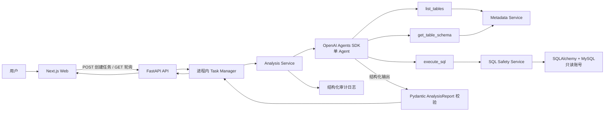
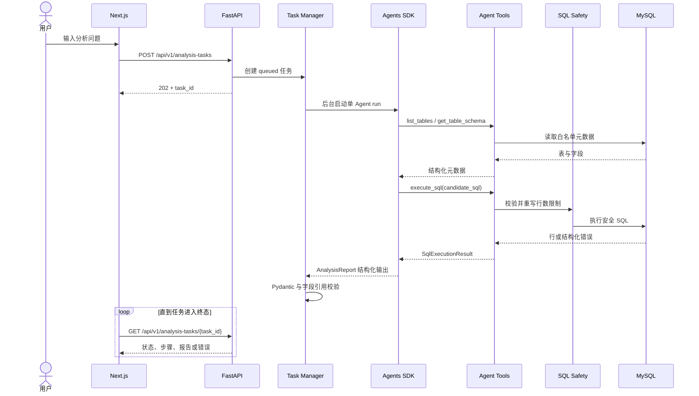
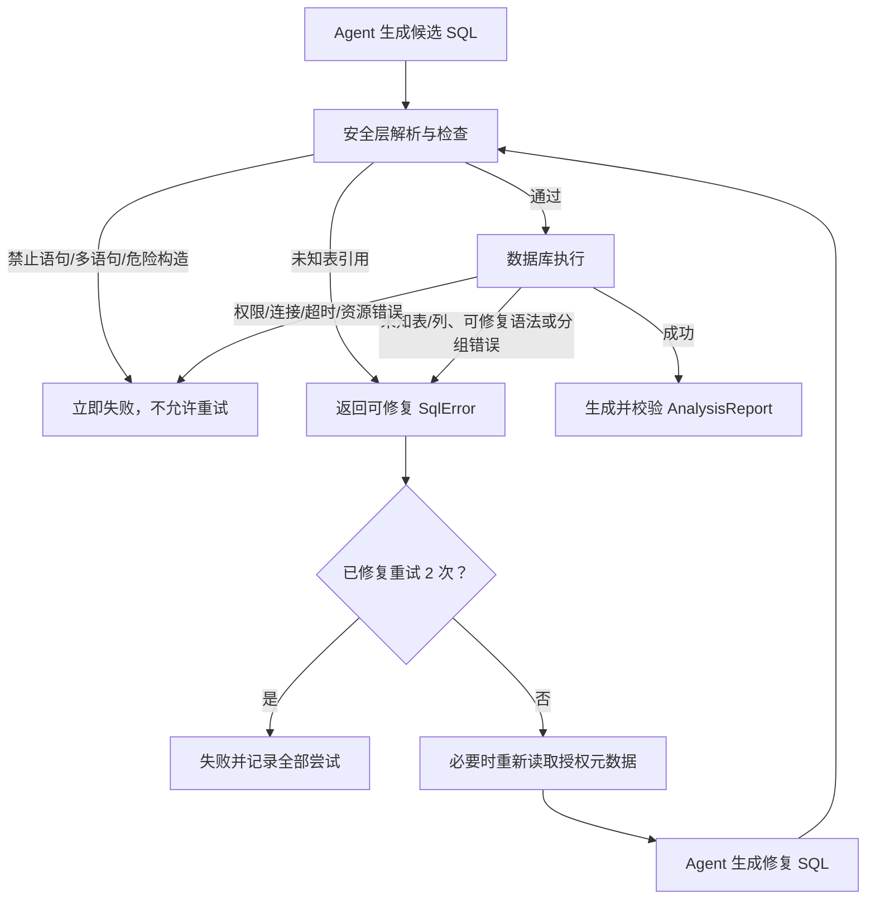

# MVP 架构总览

状态：已批准设计

日期：2026-07-14

## 设计结论

MVP 采用单仓库、前后端分离进程、单个分析 Agent、单个 MySQL 数据源和 FastAPI 进程内任务状态。前端通过 `POST` 创建任务，再通过 `GET` 轮询状态。FastAPI 是唯一编排与信任边界；OpenAI Agents SDK 负责推理和工具选择，但 SQL 权限、语句安全、超时、行数、工具调用次数和重试次数全部由确定性的 Python 代码与 MySQL 只读权限强制执行。

`build_report` 不作为 Agent 工具。Agent 完成查询后直接以 `AnalysisReport` 作为结构化输出类型，后端使用 Pydantic 校验。这减少一次没有外部副作用的工具调用、降低失败面，也让最终协议与 Agent 运行时解耦。

## 总体架构



## 组件职责

### Next.js 前端

- 收集并校验用户问题，不持有数据库或 OpenAI 密钥。
- 创建分析任务并按固定间隔轮询状态。
- 展示排队、运行、成功、失败和需要用户介入状态。
- 展示可公开的执行步骤、最终 SQL、表格、ECharts 图表和结论。
- 停止轮询终态任务，对网络错误采用有限退避；不在浏览器中实现 Agent 或 SQL 逻辑。

### FastAPI API

- 实现 HTTP 输入校验、任务创建、状态查询和统一错误响应。
- 为每个任务生成服务端 ID，管理进程内任务状态。
- 启动 Analysis Service，限制并发和任务生命周期。
- 将内部模型映射为前端安全响应，隐藏原始数据库错误和敏感 trace。
- MVP 不提供跨重启恢复、分布式锁或多 worker 一致性。

### Analysis Service

- 组装 Agent 上下文和三个允许的工具。
- 维护确定性的工具调用预算与 SQL 尝试计数。
- 收集 `AgentExecutionStep` 和审计事件。
- 分类终止原因，校验最终 `AnalysisReport`，更新任务终态。
- Agent SDK 异常、模型拒绝或结构化输出失败只能有限失败，不能形成隐式无限重跑。

### OpenAI Agents SDK

- 运行一个数据分析 Agent，理解用户问题并决定何时查看元数据或执行 SQL。
- 通过 function tools 调用后端能力。
- 将普通、可修复 SQL 错误作为工具结果继续纳入推理。
- 最终按 `AnalysisReport` 输出结构化结果。
- SDK tracing 可用于开发诊断，但默认不得包含敏感工具和模型数据。官方 SDK 支持 function tools、Pydantic 结构化输出和 tracing；具体 SDK 与模型版本在骨架任务中锁定。

### Agent 工具

- `list_tables`：只返回允许访问的表名和可选备注，不返回数据库全量目录。
- `get_table_schema`：只接受白名单表名，返回字段名、类型、可空性和备注。
- `execute_sql`：接收候选 SQL，调用安全层并执行；成功和失败都返回结构化对象，普通 SQL 错误不抛出到 Agent runner。
- 工具是适配层，不拥有任务重试循环、HTTP 响应或数据库权限策略。

### SQL Safety Service

- 使用支持 MySQL 方言的 AST 解析器检查 SQL。推荐仅增加一个聚焦依赖 SQLGlot；不使用正则表达式充当主解析器，也不自研 SQL 语法树。
- 强制单语句，且根查询只能是 `SELECT` 或最终产生查询的 `WITH`。
- 拒绝 DML、DDL、管理命令、文件读写、危险函数/构造以及注释或分号绕过。
- 提取引用表并与白名单比对；未知表返回不泄露真实库信息的可修复错误，明确禁用的语句立即终止。
- 对查询强制行数上限。优先在 AST 上设置或收紧顶层 `LIMIT`，同时在结果读取层二次截断。
- 向数据库层传递超时设置，并产生稳定的错误分类。

### Database Service 与 MySQL

- SQLAlchemy 管理连接池、只读连接和查询执行。
- 元数据读取与业务查询共用白名单策略，但接口分离。
- MySQL 账号只授予目标 schema 的 `SELECT` 权限；禁止写权限和管理权限。
- 数据库负责最终权限、资源和超时边界，Python 安全层不能替代数据库授权。

### Report Contract

- `AnalysisReport` 是后端、Agent 最终输出和前端之间的稳定契约。
- 报告包含标题、结论列表、最终 SQL、表格、图表规格和查询元信息。
- 图表规格表达数据字段映射，不允许 Agent 直接返回任意 ECharts JavaScript 或可执行 formatter。
- 后端校验图表字段确实存在于表格列中；无合适图表时允许 `chart: null`。

## 完整请求流程



## SQL 自动修复流程

首次 SQL 执行不计为“重试”；之后最多允许两次修复执行，因此单任务最多执行三次候选 SQL。



每次尝试必须记录 `attempt`、候选 SQL、公开错误分类、内部原始错误、元数据工具调用和耗时。原始数据库错误只进入受控内部日志，不直接返回浏览器或完整注入不可信上下文。

## 错误处理边界

### 可自动修复

- 授权范围内的表名拼写或错误表选择：重新调用 `list_tables`，必要时读取候选 schema。
- 字段名、别名或限定符错误：重新读取相关 schema 后修复。
- MySQL 方言下的轻量语法、函数名称、聚合与 `GROUP BY` 错误。
- 结果为空但 SQL 本身成功：允许 Agent 说明“未查询到数据”，不得盲目改写条件反复查询；若无法判断是确实无数据还是条件歧义，则请求用户介入。
- SQL 解析失败但未检测到危险意图：可作为一次可修复尝试，仍受两次上限约束。

### 必须停止或请求用户介入

- 写入、DDL、多语句、危险函数、注释绕过或其他明确安全违规：状态为 `failed`。
- 数据库权限、连接、凭据、超时或资源限制错误：状态为 `failed`，由运维/开发处理。
- 找不到授权表、指标口径缺失、时间范围或维度存在影响结论的歧义：状态为 `requires_input`。
- 用户要求访问白名单外数据或执行写入：`failed`，返回安全说明而不透露库信息。
- 工具调用预算、两次 SQL 修复上限或总任务超时耗尽：`failed`。
- 模型无法输出有效 `AnalysisReport`：有限校验失败后终止，不用无限重跑掩盖协议错误。

## 安全边界

1. **浏览器边界**：无数据库凭据、OpenAI 密钥和原始内部错误。
2. **HTTP 边界**：Pydantic 输入校验、问题长度、请求大小和并发限制。
3. **Agent 边界**：仅注册三个工具；上下文不提供任意网络、文件或代码执行能力。
4. **工具边界**：工具调用预算和参数模型校验；所有 SQL 只能进入 Safety Service。
5. **SQL 边界**：AST 校验、单语句、白名单、行数与超时。
6. **数据库边界**：只读账号和单一脱敏 schema。
7. **输出边界**：报告字段、图表字段引用和错误消息净化。
8. **观测边界**：日志与 trace 默认最小化敏感数据，凭据永不记录。

## 目录与依赖方向

```text
frontend -> FastAPI API -> Analysis Service -> Agent Runner -> Tools
                                                   |          |
                                                   |          +-> Metadata Service -> Database
                                                   +------------> SQL Safety -> Database
```

依赖只向内流向稳定契约和服务接口。Agent 工具依赖后端服务，后端服务不依赖 Agent 装饰器；这样未来可以替换 Agent runtime，而无需重写数据库与安全逻辑。

## 后续扩展触发条件

以下是扩展触发条件，不是当前路线图承诺：

- 需要重启恢复、长任务排队或多实例时，再评估持久任务表、Redis/Celery 或其他队列。
- 出现复杂分支、人工审批、可暂停恢复的长流程时，再评估 LangGraph。
- 出现多个明确专业角色且单 Agent 评测持续失败时，再评估多 Agent。
- 业务口径无法仅靠 schema 支撑且已具备治理流程时，再评估 WrenAI 或其他语义层。
- 第二种数据库需求经过真实验证后，再抽象方言和连接器接口。
- 真实用户隔离与合规需求出现后，再设计认证、多租户和细粒度授权。

任何扩展都必须新增 ADR，并证明当前简单方案已无法满足已出现的需求。

## 待验证假设

- MySQL 版本、schema、只读账号和字段备注质量尚未确认。
- SQLGlot 对目标 MySQL 版本与项目所需语法的覆盖需要通过安全测试验证。
- 进程内并发数、轮询间隔、最大行数、查询超时、总任务超时和工具调用上限尚待性能基线后锁定。
- OpenAI 模型与 SDK 版本尚未锁定；选择的模型必须支持 function calling 和结构化输出。
