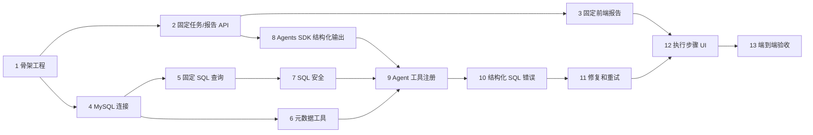

# Agentic Analytics MVP 实施计划

> 面向执行的 Agent：一次只实现一个任务。采用测试驱动开发，按任务更新本文件和 `docs/handoffs/latest.md`，每个任务结束后停下来复核。不要把这份计划混进架构文档提交里。

**目标：** 交付一个本地可运行的 Web 流程，把自然语言问题转成一次安全执行的只读 MySQL 查询，并输出经过校验的表格、图表、SQL 和结论报告。

**架构：** Next.js 前端创建并轮询进程内 FastAPI 任务。一个 OpenAI Agents SDK Agent 只负责读取允许的元数据并调用确定性的 SQL 执行边界；Python 和 MySQL 共同强制安全约束和最多两次修复。最终报告由 Agent 产出结构化结果，再由 Pydantic 校验。

**技术栈：** Next.js、React、TypeScript、Ant Design、ECharts、Vitest、Python、FastAPI、OpenAI Agents SDK、SQLAlchemy、Pydantic、MySQL、pytest、Docker Compose。

## 全局约束

- 仅使用一套 MySQL 测试/脱敏数据库和一个只读账号。
- 仅使用一个 FastAPI 进程/worker 来保存任务状态。
- Agent 只允许暴露三个工具：`list_tables`、`get_table_schema`、`execute_sql`。
- 初始 SQL 尝试加上最多两次修复，`MAX_SQL_RETRIES=2`。
- SQL 策略和数据库权限共同强制只读，提示词不是安全边界。
- 不引入 WrenAI、LangGraph、多个 Agent、Redis、Celery、Kubernetes、MinIO、多租户、向量数据库、任意代码执行或多数据库框架。
- 依赖版本和默认限制先标记为**待验证假设**，直到任务 1/任务 7 的测试和锁定完成。
- 每个实现任务都要走红绿重构，并且独立提交。

## 当前状态

| 项目 | 状态 |
| --- | --- |
| 产品范围 | 已完成文档 |
| 架构和 ADR | 已完成文档 |
| 接口契约 | 已完成文档 |
| 应用实现 | 已完成全部 13 个任务；本次新增强边界与 watchdog |
| 测试套件 | 后端 88 通过、2 跳过；前端 Vitest 通过；Docker 三服务 healthy |

## 依赖关系图和推荐顺序

任务 2/3 和 4/5/6 可以在任务 1 之后并行推进，但最终集成仍按编号顺序完成。

## 任务 1：项目骨架和健康检查

**状态：** 已完成（2026-07-14）
**目标：** 建立最小的前后端包、已验证并锁定的依赖、配置校验、Docker Compose 和健康检查，不包含分析行为。

**文件：**

- 新建 `docker-compose.yml`、`.env.example`、`.gitignore`。
- 新建 `backend/pyproject.toml`、`backend/app/__init__.py`、`backend/app/main.py`、`backend/app/config.py`、`backend/tests/test_health.py`。
- 新建 `frontend/package.json`、`frontend/tsconfig.json`、`frontend/next.config.ts`、`frontend/src/app/layout.tsx`、`frontend/src/app/page.tsx`、`frontend/tests/health.test.tsx`。
- 修改 `README.md`、`docs/plans/current.md`、`docs/handoffs/latest.md`。

**输入接口：** `README.md` 中记录的环境变量；`GET /health`。
**输出接口：** FastAPI 返回 `{ "status": "ok" }`，前端壳页面能明确说明当前处于文档/骨架阶段。

**验收标准：**

- `docker compose config` 成功，且包含一个前端、一个后端和一个本地 MySQL 服务。
- 前后端都能启动，`/health` 返回 `200`。
- 缺失必需配置时返回清晰的配置错误，且不泄露秘密值。
- 依赖版本经过兼容性检查并锁定，没有引入禁止依赖。

**验证结果：** 已生成并验证 `backend/uv.lock` 与 `frontend/package-lock.json`；`docker compose config` 成功，Compose 容器内后端 2 项 pytest 和前端 1 项 Vitest 测试均通过，运行中的 `GET /health` 返回 `200` 与 `{"status":"ok"}`。
**测试：** `docker compose config`、`docker compose run --rm --no-deps backend uv run pytest tests/test_health.py -v`、`docker compose run --rm --no-deps frontend npm run test -- --run tests/health.test.tsx`。
**依赖：** 仅依赖已批准的架构文档。
**推荐提交：** `chore: scaffold MVP services and health checks`

## 任务 2：固定任务生命周期和报告 JSON API

**状态：** 已完成（2026-07-14）
**目标：** 实现进程内任务注册表和 API 契约，先用一个确定性的固定报告验证状态流转，再引入模型和数据库。

**文件：**

- 新建 `backend/app/api/analysis_tasks.py`、`backend/app/schemas/analysis.py`、`backend/app/services/task_service.py`。
- 新建 `backend/tests/api/test_analysis_tasks.py`、`backend/tests/services/test_task_service.py`、`backend/tests/fixtures/fixed_report.py`。
- 修改 `backend/app/main.py`。

**输入接口：** `POST /api/v1/analysis-tasks` 接收 `AnalysisRequest`，`GET /api/v1/analysis-tasks/{task_id}` 接收 UUID。
**输出接口：** 返回 `202 AnalysisTaskStatus`，然后稳定地经历 `queued -> running -> succeeded`，并输出一个合法的固定 `AnalysisReport`；未知 UUID 返回 `404`。

**验收标准：**

- 请求和响应字段/约束与 `docs/architecture/interfaces.md` 一致。
- 仅空白或超长问题返回 `422`。
- 终态任务包含报告/完成时间；非终态任务不包含这些字段。
- 注册表丢失语义和单 worker 限制必须写入代码和测试说明。

**验证结果：** 已实现严格 Pydantic 请求/响应契约、单进程内存注册表及单 worker 槽位。创建请求返回 `queued` 快照，后台固定分析按 `queued -> running -> succeeded` 转换；服务重启或未知 UUID 统一返回 `TASK_NOT_FOUND`。终态包含固定报告和 `completed_at`，非终态不包含终态字段。
**测试：** `uv run --frozen pytest tests/api/test_analysis_tasks.py tests/services/test_task_service.py -v`，6 项通过。
**依赖：** 任务 1。
**推荐提交：** `feat: add in-process analysis task contract`

## 任务 3：固定前端报告展示

**状态：** 已完成（2026-07-14）
**目标：** 使用任务 2 的固定响应，证明浏览器侧完整呈现契约。

**文件：**

- 新建 `frontend/src/features/analysis/AnalysisPage.tsx`、`AnalysisForm.tsx`、`TaskStatus.tsx`、`ReportView.tsx`、`ReportTable.tsx`、`ReportChart.tsx`。
- 新建 `frontend/src/services/analysis-api.ts`、`frontend/src/types/analysis.ts`。
- 新建 `frontend/tests/analysis-page.test.tsx`、`frontend/tests/report-view.test.tsx`、`frontend/tests/fixtures/analysis.ts`。
- 修改 `frontend/src/app/page.tsx`。

**输入接口：** 用户问题和任务 2 的创建/轮询 API。
**输出接口：** 可见状态、最终 SQL、Ant Design 表格、本地生成的 ECharts option、摘要、假设和警告。

**验收标准：**

- 禁止空提交；合法提交只轮询非终态任务。
- 轮询在 `succeeded`、`failed` 或 `requires_input` 时停止，并且遇到任务 `404` 时不自动重提。
- `chart: null` 必须呈现清晰的仅表格结果。
- 任意响应字段都不能以原始 HTML 渲染，也不能执行服务端提供的代码。

**测试：** `npm run test -- --run frontend/tests/analysis-page.test.tsx frontend/tests/report-view.test.tsx`，并手工核对桌面和移动端布局。
**依赖：** 任务 2。
**推荐提交：** `feat: render fixed analysis reports`

## 任务 4：只读 MySQL 连接

**状态：** 已完成（2026-07-14）
**目标：** 将 SQLAlchemy 连接到一个本地 MySQL 测试数据库，并用已验证的配置和最小权限凭据进行保护。

**文件：**

- 新建 `backend/app/database.py`、`backend/tests/database/test_config.py`、`backend/tests/database/test_database.py`、`backend/tests/database/test_connection.py`、`mysql/init/001-schema-and-readonly-user.sql`。
- 修改 `backend/pyproject.toml`、`backend/uv.lock`、`backend/app/config.py`、`backend/tests/conftest.py`、`docker-compose.yml`、`.env.example`、`README.md`。

**输入接口：** 后端持有的 `DATABASE_URL` 和白名单配置。
**输出接口：** `create_engine_for_settings(settings)` 和 `connection_for_settings(settings)`；连接上下文结束时归还连接。

**验收标准：**

- 测试数据库使用脱敏、确定性数据初始化。
- 应用账号可以 `SELECT` 允许的表，但数据库级测试证明写入和 DDL 会失败。
- 凭据只保留在服务端，不出现在 API 响应、日志或前端产物中。
- 成功和失败路径都能正确关闭连接。

**验证结果：** 真实 MySQL 8.4 容器初始化 6 条确定性样例数据；应用账号可 `SELECT`，并在集成测试中被数据库拒绝 `INSERT` 与 `DROP TABLE`。宿主机端口固定为 `3307`，避免干扰本机已有 MySQL。
**测试：** `uv run --frozen pytest tests/database/test_connection.py -v -m integration`，并显式断言被拒绝的 `INSERT` 和 `DROP`。
**依赖：** 任务 1。
**推荐提交：** `feat: connect read-only MySQL test database`

## 任务 5：固定 SQL 查询垂直切片

**状态：** 已完成（2026-07-14）
**目标：** 用一条硬编码、由开发者拥有的只读查询替换固定报告行，验证数据库结果转换和报告传输。

**文件：**

- 新建 `backend/app/query.py`、`backend/app/services/fixed_analysis.py`。
- 新建 `backend/tests/database/test_query.py`、`backend/tests/services/test_fixed_analysis.py`。
- 修改 `backend/app/api/analysis_tasks.py`、`backend/app/services/task_service.py`。

**输入接口：** 固定分析服务调用；不接受客户端传入的 SQL。
**输出接口：** `SqlExecutionResult` 被转换成现有的 `AnalysisReport` 契约。

**验收标准：**

- `Decimal`、`date`、`datetime`、`null` 值都会转换成文档中定义的 JSON 兼容值。
- 列顺序、`row_count`、`truncated`、SQL 和耗时都正确。
- 驱动失败会变成终态、已脱敏的任务错误，而不是直接把堆栈响应给前端。

**验证结果：** 默认应用任务会查询 `sales_channel_monthly` 的 6 条记录，将 `date` 和 `Decimal` 转为 JSON 值，返回月度渠道销售额折线图报告；客户端不能传入 SQL。
**测试：** `uv run --frozen pytest tests/database/test_query.py tests/services/test_fixed_analysis.py tests/api/test_analysis_tasks.py -v`。
**依赖：** 任务 2 和任务 4。
**推荐提交：** `feat: return report data from fixed MySQL query`

## 任务 6：数据库元数据工具

**状态：** 已完成
**目标：** 以类型化函数实现允许列表内的表发现和表结构查看，但暂时不接入 Agent。

**文件：**

- 新建 `backend/app/database/metadata.py`、`backend/app/tools/list_tables.py`、`backend/app/tools/get_table_schema.py`、`backend/app/schemas/tools.py`。
- 新建 `backend/tests/tools/test_list_tables.py`、`backend/tests/tools/test_get_table_schema.py`。

**输入接口：** `list_tables` 无输入；`get_table_schema` 使用 `{ table_name: str }`；后端白名单配置。
**输出接口：** 与 `docs/architecture/interfaces.md` 一致的工具 JSON 契约。

**验收标准：**

- 仅返回允许的 schema/table。
- 列名、类型、是否可空、注释都必须稳定且可 JSON 序列化。
- 未知/被拦截的表返回已脱敏的类型化错误，不泄露隐藏元数据。
- 元数据调用不能执行任意 SQL。

**测试：** `pytest backend/tests/tools/test_list_tables.py backend/tests/tools/test_get_table_schema.py -v`。
**依赖：** 任务 4。
**推荐提交：** `feat: add allowlisted metadata tools`

## 任务 7：SQL 安全策略和受限执行

**状态：** 待办
**目标：** 为模型生成的 SQL 构建确定性的门禁，并把它放到所有动态查询执行之前。

**文件：**

- 新建 `backend/app/services/sql_policy.py`、`backend/app/services/sql_executor.py`。
- 新建 `backend/tests/security/test_sql_policy.py`、`backend/tests/security/test_read_only_database.py`、`backend/tests/services/test_sql_executor.py`。
- 修改 `backend/app/config.py`、`backend/app/database/query.py`、`.env.example`。

**输入接口：** 一条 SQL 字符串以及服务端持有的白名单、最大行数、超时和尝试上下文。
**输出接口：** 通过校验的规范化 SQL 和 `SqlExecutionResult`，或者一个分类后的 `SqlError`/策略拒绝结果。

**验收标准：**

- 已在文档中说明并锁定一个 MySQL 感知的解析器选择。
- 普通 `SELECT` 和 CTE `SELECT` 可以通过；多语句、错误/歧义 SQL、写入、DDL、管理/文件/锁操作以及未批准对象都必须闭合失败。
- 服务端行数上限不能被模型 SQL 提升或绕过。
- 超时和只读数据库权限都要单独测试。
- 关键字出现在字符串/标识符中的情况，以及注释/分号绕过尝试，都要有回归测试。

**测试：** `pytest backend/tests/security backend/tests/services/test_sql_executor.py -v`，并在 handoff 中记录精确的安全用例数量。
**依赖：** 任务 4 和任务 5。
**推荐提交：** `feat: enforce read-only SQL execution policy`

## 任务 8：OpenAI Agents SDK 结构化输出集成

**状态：** 已完成
**目标：** 用一个 SDK 驱动的 Agent 替换确定性报告生成器，先不接数据库工具，直接返回 `AnalysisReport`。

**文件：**

- 新建 `backend/app/agents/analysis_agent.py`、`backend/app/agents/prompts.py`、`backend/app/agents/runner.py`。
- 新建 `backend/tests/agents/test_runner.py`、`backend/tests/agents/fakes.py`。
- 修改 `backend/app/config.py`、`backend/app/services/task_service.py`、`.env.example`。

**输入接口：** 已校验的问题和注入的 model/runner 依赖。
**输出接口：** 经过 Pydantic 校验的 `AnalysisReport`，或者一个已脱敏的 `provider_error`/`invalid_report` 任务失败。

**验收标准：**

- 选定的 Agents SDK/model 版本必须锁定并验证支持结构化输出。
- 单元测试必须使用 fake runner，常规测试不需要网络或 API key。
- 缺少凭据时要清晰地失败，并且不能泄露密钥。
- 无效输出绝不能作为成功报告进入前端。

**测试：** `pytest backend/tests/agents/test_runner.py -v`；只有在显式配置时才运行一次可选的 live smoke test。
**依赖：** 任务 1 和任务 2。
**推荐提交：** `feat: add structured analysis Agent runtime`

## 任务 9：注册并编排 Agent 工具

**状态：** 待办
**目标：** 给单个 Agent 接上三个批准的工具，并证明一次从元数据到查询再到报告的成功运行。

**文件：**

- 新建 `backend/app/tools/execute_sql.py`、`backend/app/agents/coordinator.py`。
- 新建 `backend/tests/agents/test_coordinator.py`、`backend/tests/tools/test_execute_sql.py`。
- 修改 `backend/app/agents/analysis_agent.py`、`backend/app/agents/runner.py`、`backend/app/services/task_service.py`。

**输入接口：** 问题、类型化的元数据/查询工具依赖、服务端预算。
**输出接口：** 已校验的报告和有序的后端执行事件；注册的工具名必须恰好三个。

**验收标准：**

- 一个 fake 脚本化 Agent 必须先调用元数据，再执行安全查询，并根据返回行生成报告。
- 工具包装器不能接受客户端控制的连接/行数/超时/尝试参数。
- 总工具调用预算由模型外部强制控制。
- `build_report` 和任意代码工具都必须不存在。

**测试：** `pytest backend/tests/agents/test_coordinator.py backend/tests/tools/test_execute_sql.py -v`。
**依赖：** 任务 6、任务 7 和任务 8。
**推荐提交：** `feat: orchestrate approved analytics tools`

## 任务 10：结构化 SQL 错误返回

**状态：** 待办
**目标：** 把预期中的解析器/驱动失败转换成已脱敏、确定性的 `SqlError` 值，而不是意外终止 Agent 运行。

**文件：**

- 新建 `backend/app/database/errors.py`。
- 新建 `backend/tests/database/test_errors.py`、`backend/tests/agents/test_sql_error_flow.py`。
- 修改 `backend/app/services/sql_executor.py`、`backend/app/tools/execute_sql.py`、`backend/app/agents/coordinator.py`。

**输入接口：** 解析器/SQLAlchemy/驱动异常，以及失败的 SQL 和尝试上下文。
**输出接口：** `SqlErrorCode`、已脱敏的消息、后端赋值的 `retryable`、尝试次数、可选的数据库代码/提示。

**验收标准：**

- 未知表、未知列、语法、类型、权限、超时、连接、资源和通用执行错误都必须稳定映射。
- 只有架构里标注为允许重试的 schema/syntax 类错误才可重试。
- 凭据、主机、连接 URL、堆栈和隐藏对象名都要从公开/工具消息中移除。
- 预期中的 SQL 错误应该是值；意外的编程错误仍然需要让任务失败并安全记录。

**测试：** `pytest backend/tests/database/test_errors.py backend/tests/agents/test_sql_error_flow.py -v`。
**依赖：** 任务 9。
**推荐提交：** `feat: return sanitized SQL execution errors`

## 任务 11：有界自动 SQL 修复

**状态：** 已完成（2026-07-14）
**目标：** 完成错误反馈闭环，允许恰好两次修复重试，并显式停止或请求用户补充信息。

**文件：**

- 新建 `backend/app/services/retry_policy.py`。
- 新建 `backend/tests/services/test_retry_policy.py`、`backend/tests/agents/test_sql_repair.py`。
- 修改 `backend/app/agents/coordinator.py`、`backend/app/agents/prompts.py`、`backend/app/services/task_service.py`。

**输入接口：** 尝试次数、已分类的 `SqlError`、元数据/工具预算，以及 Agent 建议的修复 SQL。
**输出接口：** 下一次尝试、`requires_input`，或者终态 `failed`；最大 SQL 尝试次数始终等于三次。

**验收标准：**

- 未知列触发 schema 刷新，并且可以在第 2 次尝试成功。
- 未知表触发表刷新，并且可以在第 2 次尝试成功。
- 连续三次失败后必须以 `retry_exhausted` 停止，不能发生第 4 次执行调用。
- 非安全、权限、超时、连接和资源错误不允许自动修复。
- 含糊的纠正必须停止并返回 `requires_input`，不能靠猜。

**测试：** `pytest backend/tests/services/test_retry_policy.py backend/tests/agents/test_sql_repair.py -v`，并断言精确的工具/尝试次数。
**依赖：** 任务 10。
**推荐提交：** `feat: bound SQL repair to two retries`
**本次加固：** 工具入口 `ApprovedAnalysisTools._fail_fast_if_terminal` 强制：一旦 `terminal_error` 已落地或 `max_tool_calls` 预算耗尽，立即 `raise AgentRunError.with_code(...)` 中断 Agent SDK 的当前轮次，杜绝 LLM 自驱反复重试。同时把 `AgentRunError` 的 `(code, message)` 实例签名替换为 `with_code(code, message)` 工厂，避免子类签名被覆盖。

## 任务 12：执行步骤和终态 UI

**状态：** 已完成（2026-07-14）
**目标：** 从真实协调器暴露安全、有序的执行进度，并渲染成功、失败和澄清三种状态。

**文件：**

- 新建 `backend/app/services/execution_steps.py`、`backend/tests/services/test_execution_steps.py`。
- 新建 `frontend/src/features/analysis/ExecutionSteps.tsx`、`frontend/tests/execution-steps.test.tsx`。
- 修改 `backend/app/services/task_service.py`、`backend/app/agents/coordinator.py`、`frontend/src/features/analysis/TaskStatus.tsx`、`frontend/src/types/analysis.ts`。

**输入接口：** 协调器事件和轮询得到的 `AnalysisTaskStatus.steps`。
**输出接口：** 稳定递增的序列、安全消息/时间戳，以及互相区分的终态 UI。

**验收标准：**

- 轮询不能重排或重复已有的 step 序号。
- 步骤需要展示元数据/工具/查询/报告阶段以及 SQL 尝试号，但不能泄露思维链或秘密。
- UI 必须区分 `failed` 和 `requires_input`，并展示可操作的公开消息。
- 不允许凭空发明进度百分比。

**测试：** `pytest backend/tests/services/test_execution_steps.py -v` 和 `npm run test -- --run frontend/tests/execution-steps.test.tsx`。
**依赖：** 任务 3 和任务 11。
**推荐提交：** `feat: display analysis execution steps`
**本次加固：** `ExecutionStepRecorder` 新增 `_open_steps` 列表 + `finalize_open_steps()`，并在 `DynamicAnalysisCoordinator.run()` 外层包 `try/except Exception` 调 `_finalize_open_steps`。任何 `report_generation` 步骤抛非 `ValidationError` 异常（含 `JSONDecodeError`/`ValueError`）都会被同一 `try/except` 关闭成 `FAILED`，从此每个 started 步骤的 `finished_at` 必落。

## 任务 13：端到端验收套件和运行手册

**状态：** 已完成（2026-07-14）
**目标：** 用五个固定问题和核心安全回归验证完整的 Docker Compose 流程，然后补齐可重复运行的操作文档。

**文件：**

- 新建 `tests/e2e/analysis.spec.ts`、`tests/e2e/fixtures/questions.json`。
- 新建 `docs/runbooks/local-development.md`、`docs/runbooks/troubleshooting.md`。
- 修改 `README.md`、`docker-compose.yml`、`docs/product/mvp-scope.md`、`docs/plans/current.md`、`docs/handoffs/latest.md`。

**输入接口：** 正在运行的本地栈和五个确定性问题：趋势、对比、排名、构成，以及一个强制 schema 修复的场景。
**输出接口：** 浏览器可见的终态报告和保留的测试证据；不接触生产数据。

**验收标准：**

- 五个问题都达到预期结构结果；修复场景要证明精确的尝试次数。
- 浏览器验证状态/步骤、最终 SQL、表格、图表或合法的仅表格回退，以及结论。
- 安全套件证明代表性的禁止 SQL 永远不会到达 MySQL。
- 运行手册必须能复现安装、重置、测试、常见故障和任务丢失限制。
- `docs/product/mvp-scope.md` 中每一条验收标准都要有测试证据或明确的人工检查。

**测试：** 运行 `docker compose up --build -d`，完成后端/前端套件，运行选定的浏览器测试命令，然后执行 `docker compose down -v`；在 handoff 中记录版本、命令、通过数和失败项。
**依赖：** 任务 1 至任务 12。
**推荐提交：** `test: add MVP end-to-end acceptance suite`
**本次加固（运维硬边界）：**
- 新增 `.env` 配置项 `TASK_TIMEOUT_SECONDS`（默认 90）和配置字段 `task_timeout_seconds`（10 ≤ 默认 ≤ 600）。
- `TaskService` 在 `run_analysis` 中以 `Timer` 启动 daemon 守护线程；超时静默调 `fail_task` 并写入 `ANALYSIS_TIMEOUT` 错误，主线程继续运行不被打断。
- `succeed_task`/`fail_task` 在状态非 `RUNNING` 时静默返回，避免 watchdog 抢跑后主线程触发 `ValueError`。
- `QUERY_TIMEOUT_MS` 默认 5_000，按表聚合上调到 15_000 让 `dm.dm_sale_dy_total` 3 月聚合能在 1 次内跑通。

## 总体验收方式

在宣布 MVP 完成之前，必须先完成以下检查：

1. 将 12 条产品验收标准逐条映射到通过的自动化测试，或者明确的一次人工验证。
2. 从干净的本地环境运行完整的后端、前端、安全和浏览器测试套件。
3. 独立验证 MySQL 权限，确保拒绝写入/DDL 的测试有效，不依赖 Python SQL 策略。
4. 检查前端产物和 API/日志样本里是否有秘密或原始堆栈。
5. 确认任务不会超过三次 SQL 尝试，也不会超过配置的工具调用预算。
6. 将已实现的契约与 `docs/architecture/interfaces.md` 对照，必要时更新文档以反映真实行为。
7. 用精确证据和任何剩余限制更新 `docs/handoffs/latest.md`。
