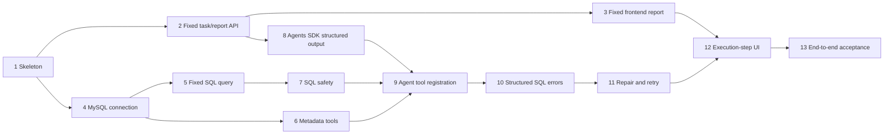

# Agentic Analytics MVP Implementation Plan

> For agentic workers: implement one task at a time. Use test-driven development, update this file and `docs/handoffs/latest.md`, and stop for review after each task. Do not execute this plan as part of the architecture-documentation commit.

**Goal:** Deliver one locally runnable web flow that turns a natural-language question into a safely executed read-only MySQL query and a validated table/chart/SQL/conclusion report.

**Architecture:** A Next.js frontend creates and polls process-local FastAPI tasks. One OpenAI Agents SDK Agent can inspect allowed metadata and call a deterministic SQL execution boundary; Python and MySQL enforce safety and two-repair limits. The final report is Agent structured output validated by Pydantic.

**Tech stack:** Next.js, React, TypeScript, Ant Design, ECharts, Vitest, Python, FastAPI, OpenAI Agents SDK, SQLAlchemy, Pydantic, MySQL, pytest, Docker Compose.

## Global constraints

- One MySQL test/desensitized database and one read-only account.
- One FastAPI process/worker while task status is in memory.
- Exactly three Agent tools: `list_tables`, `get_table_schema`, `execute_sql`.
- Initial SQL attempt plus at most two repairs (`SQL_MAX_RETRIES=2`).
- SQL policy and database grants enforce read-only access; prompts are not a security control.
- No WrenAI, LangGraph, multiple Agents, Redis, Celery, Kubernetes, MinIO, multi-tenancy, vector database, arbitrary code, or multi-database framework.
- Dependency versions/default limits remain **待验证假设** until Task 1/Task 7 tests and pins them.
- Every implementation task uses red-green-refactor and an independent commit.

## Current status

| Item | Status |
| --- | --- |
| Product scope | Completed in documentation |
| Architecture and ADRs | Completed in documentation |
| Interface contracts | Completed in documentation |
| Application implementation | Not started |
| Test suites | Not started |

## Dependency map and recommended order

Tasks 2/3 and 4/5/6 can progress as separate branches after Task 1, but integration should follow the numbered order.

## Task 1: Project skeleton and health checks

**Status:** Pending
**Goal:** Establish minimal frontend/backend packages, pinned verified dependencies, configuration validation, Docker Compose, and health checks without analysis behavior.

**Files:**

- Create `docker-compose.yml`, `.env.example`, `.gitignore`.
- Create `backend/pyproject.toml`, `backend/app/__init__.py`, `backend/app/main.py`, `backend/app/config.py`, `backend/tests/test_health.py`.
- Create `frontend/package.json`, `frontend/tsconfig.json`, `frontend/next.config.ts`, `frontend/src/app/layout.tsx`, `frontend/src/app/page.tsx`, `frontend/tests/health.test.tsx`.
- Modify `README.md`, `docs/plans/current.md`, `docs/handoffs/latest.md`.

**Input interface:** Environment variables documented in `README.md`; `GET /health`.
**Output interface:** `{ "status": "ok" }` from FastAPI and a frontend shell that identifies the documentation/skeleton stage.

**Acceptance criteria:**

- `docker compose config` succeeds with one frontend, one backend, and one local MySQL service.
- Backend and frontend start; `/health` returns `200`.
- Missing required settings fail with a clear configuration error and no secret value.
- Dependency versions are pinned after checking compatibility; no prohibited dependency is present.

**Test:** Run `docker compose config`, `docker compose run --rm backend pytest backend/tests/test_health.py -v`, and `docker compose run --rm frontend npm run test -- --run`.
**Dependencies:** Approved architecture documents only.
**Recommended commit:** `chore: scaffold MVP services and health checks`

## Task 2: Fixed task lifecycle and report JSON API

**Status:** Pending
**Goal:** Implement the process-local task registry and API contracts with a deterministic fixed report, proving status transitions before adding a model or database.

**Files:**

- Create `backend/app/api/analyses.py`, `backend/app/schemas/analysis.py`, `backend/app/services/task_service.py`.
- Create `backend/tests/api/test_analyses.py`, `backend/tests/services/test_task_service.py`, `backend/tests/fixtures/fixed_report.py`.
- Modify `backend/app/main.py`.

**Input interface:** `AnalysisRequest` on `POST /api/v1/analyses`; UUID on `GET /api/v1/analyses/{task_id}`.
**Output interface:** `202 AnalysisTaskStatus`, then deterministic `queued -> running -> succeeded` with a valid fixed `AnalysisReport`; unknown UUID returns `404`.

**Acceptance criteria:**

- Request and response fields/invariants match `docs/architecture/interfaces.md`.
- Whitespace-only and overlength questions return `422`.
- Terminal tasks contain report/completion time; nonterminal tasks do not.
- Registry loss semantics and single-worker limitation are documented in code/tests.

**Test:** `pytest backend/tests/api/test_analyses.py backend/tests/services/test_task_service.py -v`.
**Dependencies:** Task 1.
**Recommended commit:** `feat: add in-process analysis task contract`

## Task 3: Fixed frontend report display

**Status:** Pending
**Goal:** Prove the complete browser presentation contract using the fixed Task 2 response.

**Files:**

- Create `frontend/src/features/analysis/AnalysisPage.tsx`, `AnalysisForm.tsx`, `TaskStatus.tsx`, `ReportView.tsx`, `ReportTable.tsx`, `ReportChart.tsx`.
- Create `frontend/src/services/analysis-api.ts`, `frontend/src/types/analysis.ts`.
- Create `frontend/tests/analysis-page.test.tsx`, `frontend/tests/report-view.test.tsx`, `frontend/tests/fixtures/analysis.ts`.
- Modify `frontend/src/app/page.tsx`.

**Input interface:** User question and the Task 2 create/poll API.
**Output interface:** Visible state, final SQL, Ant Design table, locally derived ECharts option, summary, assumptions, and warnings.

**Acceptance criteria:**

- Blank submission is blocked; a valid submission polls only nonterminal tasks.
- Polling stops on `succeeded`, `failed`, or `needs_input` and handles task `404` without automatic resubmission.
- `chart: null` produces a clear table-only result.
- No response field is rendered as raw HTML and no server-provided code is executed.

**Test:** `npm run test -- --run frontend/tests/analysis-page.test.tsx frontend/tests/report-view.test.tsx`; manually verify desktop and mobile layouts.
**Dependencies:** Task 2.
**Recommended commit:** `feat: render fixed analysis reports`

## Task 4: Read-only MySQL connection

**Status:** Pending
**Goal:** Connect SQLAlchemy to one local MySQL test database with validated configuration and least-privilege credentials.

**Files:**

- Create `backend/app/database/engine.py`, `backend/app/database/session.py`.
- Create `backend/tests/database/test_connection.py`, `backend/tests/integration/conftest.py`, `backend/tests/integration/sql/init.sql`.
- Modify `backend/app/config.py`, `docker-compose.yml`, `.env.example`, `README.md`.

**Input interface:** Backend-owned `DATABASE_URL` and allowlist settings.
**Output interface:** SQLAlchemy engine/connection dependency usable only by backend database services.

**Acceptance criteria:**

- Test database is seeded with desensitized deterministic data.
- Application account can `SELECT` allowed tables but database-level tests prove writes/DDL fail.
- Credentials stay server-side and are absent from API responses/logs/frontend assets.
- Connections close correctly after success and failure.

**Test:** `pytest backend/tests/database/test_connection.py -v -m integration`, including explicit denied `INSERT` and `DROP` assertions.
**Dependencies:** Task 1.
**Recommended commit:** `feat: connect read-only MySQL test database`

## Task 5: Fixed SQL query vertical slice

**Status:** Pending
**Goal:** Replace the fixed report rows with one hard-coded, developer-owned read-only query to prove database result conversion and report transport.

**Files:**

- Create `backend/app/database/query.py`, `backend/app/services/fixed_analysis.py`.
- Create `backend/tests/database/test_query.py`, `backend/tests/services/test_fixed_analysis.py`.
- Modify `backend/app/api/analyses.py`, `backend/app/services/task_service.py`.

**Input interface:** Fixed analysis service invocation; no client-supplied SQL.
**Output interface:** `SqlExecutionResult` converted into the existing `AnalysisReport` contract.

**Acceptance criteria:**

- Decimal/date/datetime/null values become documented JSON-compatible values.
- Column order, `row_count`, `truncated`, SQL, and timing are correct.
- Driver failure becomes a terminal sanitized task error, not a stack trace response.

**Test:** `pytest backend/tests/database/test_query.py backend/tests/services/test_fixed_analysis.py -v`.
**Dependencies:** Tasks 2 and 4.
**Recommended commit:** `feat: return report data from fixed MySQL query`

## Task 6: Database metadata tools

**Status:** Pending
**Goal:** Implement allowlisted table discovery and schema inspection as typed functions, still without an Agent.

**Files:**

- Create `backend/app/database/metadata.py`, `backend/app/tools/list_tables.py`, `backend/app/tools/get_table_schema.py`, `backend/app/schemas/tools.py`.
- Create `backend/tests/tools/test_list_tables.py`, `backend/tests/tools/test_get_table_schema.py`.

**Input interface:** Empty `list_tables` input; `{ table_name: str }` for `get_table_schema`; backend allowlists.
**Output interface:** Tool JSON contracts in `docs/architecture/interfaces.md`.

**Acceptance criteria:**

- Only allowed schemas/tables are returned.
- Column name/type/nullability/comment are stable and JSON serializable.
- Unknown/blocked tables return a sanitized typed error and do not reveal hidden metadata.
- Metadata calls cannot run arbitrary SQL.

**Test:** `pytest backend/tests/tools/test_list_tables.py backend/tests/tools/test_get_table_schema.py -v`.
**Dependencies:** Task 4.
**Recommended commit:** `feat: add allowlisted metadata tools`

## Task 7: SQL safety policy and constrained execution

**Status:** Pending
**Goal:** Build the deterministic gate for model-supplied SQL and place it in front of all dynamic query execution.

**Files:**

- Create `backend/app/services/sql_policy.py`, `backend/app/services/sql_executor.py`.
- Create `backend/tests/security/test_sql_policy.py`, `backend/tests/security/test_read_only_database.py`, `backend/tests/services/test_sql_executor.py`.
- Modify `backend/app/config.py`, `backend/app/database/query.py`, `.env.example`.

**Input interface:** One SQL string plus server-owned allowlist, max-row, timeout, and attempt context.
**Output interface:** Approved normalized SQL and `SqlExecutionResult`, or a classified `SqlError`/policy denial.

**Acceptance criteria:**

- MySQL-aware parser choice is documented and pinned after evaluation.
- Plain and CTE `SELECT` pass; multi-statements, malformed/ambiguous SQL, writes, DDL, admin/file/locking operations, and unapproved objects fail closed.
- Server row cap cannot be increased or bypassed by model SQL.
- Timeout and read-only database grants are tested independently.
- Keyword-in-string/identifier cases and comment/semicolon bypass attempts have regression tests.

**Test:** `pytest backend/tests/security backend/tests/services/test_sql_executor.py -v`; record the exact security case count in the handoff.
**Dependencies:** Tasks 4 and 5.
**Recommended commit:** `feat: enforce read-only SQL execution policy`

## Task 8: OpenAI Agents SDK structured-output integration

**Status:** Pending
**Goal:** Replace the deterministic report producer with one SDK-backed Agent that returns `AnalysisReport`, initially without database tools.

**Files:**

- Create `backend/app/agents/analysis_agent.py`, `backend/app/agents/prompts.py`, `backend/app/agents/runner.py`.
- Create `backend/tests/agents/test_runner.py`, `backend/tests/agents/fakes.py`.
- Modify `backend/app/config.py`, `backend/app/services/task_service.py`, `.env.example`.

**Input interface:** Validated question and injected model/runner dependency.
**Output interface:** Pydantic-validated `AnalysisReport` or sanitized `provider_error`/`invalid_report` task failure.

**Acceptance criteria:**

- Selected Agents SDK/model versions are pinned and verified for structured output.
- Unit tests use a fake runner; normal test runs require no network/API key.
- Missing credentials fail configuration clearly without exposing the key.
- Invalid output never reaches the frontend as a successful report.

**Test:** `pytest backend/tests/agents/test_runner.py -v`; run one opt-in live smoke test only when explicitly configured.
**Dependencies:** Tasks 1 and 2.
**Recommended commit:** `feat: add structured analysis Agent runtime`

## Task 9: Register and orchestrate Agent tools

**Status:** Pending
**Goal:** Give the single Agent the three approved tools and prove a successful metadata-to-query-to-report run.

**Files:**

- Create `backend/app/tools/execute_sql.py`, `backend/app/agents/coordinator.py`.
- Create `backend/tests/agents/test_coordinator.py`, `backend/tests/tools/test_execute_sql.py`.
- Modify `backend/app/agents/analysis_agent.py`, `backend/app/agents/runner.py`, `backend/app/services/task_service.py`.

**Input interface:** Question, typed metadata/query tool dependencies, server budgets.
**Output interface:** Validated report and ordered backend execution events; exactly three registered tool names.

**Acceptance criteria:**

- A fake scripted Agent calls metadata before executing a safe query and produces a report grounded in returned rows.
- Tool wrappers cannot accept client-controlled connection/limit/timeout/attempt values.
- Total tool-call budget is enforced outside the model.
- `build_report` and arbitrary code tools are absent.

**Test:** `pytest backend/tests/agents/test_coordinator.py backend/tests/tools/test_execute_sql.py -v`.
**Dependencies:** Tasks 6, 7, and 8.
**Recommended commit:** `feat: orchestrate approved analytics tools`

## Task 10: Structured SQL error return

**Status:** Pending
**Goal:** Convert expected parser/driver failures into sanitized, deterministic `SqlError` values without terminating the Agent run unexpectedly.

**Files:**

- Create `backend/app/database/errors.py`.
- Create `backend/tests/database/test_errors.py`, `backend/tests/agents/test_sql_error_flow.py`.
- Modify `backend/app/services/sql_executor.py`, `backend/app/tools/execute_sql.py`, `backend/app/agents/coordinator.py`.

**Input interface:** Parser/SQLAlchemy/driver exceptions plus failed SQL and attempt context.
**Output interface:** `SqlErrorCode`, sanitized message, backend-assigned `retryable`, attempt, optional database code/hint.

**Acceptance criteria:**

- Unknown table, unknown column, syntax, type, permission, timeout, connection, resource, and generic execution errors map consistently.
- Only schema/syntax classes marked in architecture are retryable.
- Credentials, hosts, connection URLs, stack traces, and hidden object names are removed from public/tool messages.
- Expected SQL errors are values; unexpected programming errors still fail the task and are logged safely.

**Test:** `pytest backend/tests/database/test_errors.py backend/tests/agents/test_sql_error_flow.py -v`.
**Dependencies:** Task 9.
**Recommended commit:** `feat: return sanitized SQL execution errors`

## Task 11: Bounded automatic SQL repair

**Status:** Pending
**Goal:** Complete the error-feedback loop with exactly two allowed repair retries and explicit stop/user-input decisions.

**Files:**

- Create `backend/app/services/retry_policy.py`.
- Create `backend/tests/services/test_retry_policy.py`, `backend/tests/agents/test_sql_repair.py`.
- Modify `backend/app/agents/coordinator.py`, `backend/app/agents/prompts.py`, `backend/app/services/task_service.py`.

**Input interface:** Attempt number, classified `SqlError`, metadata/tool budget, and Agent-proposed repaired SQL.
**Output interface:** Next attempt, `needs_input`, or terminal `failed`; maximum SQL attempts equals three.

**Acceptance criteria:**

- Unknown column triggers schema refresh and can succeed on attempt 2.
- Unknown table triggers table refresh and can succeed on attempt 2.
- Three consecutive failures stop as `retry_exhausted`; no fourth execute call occurs.
- Unsafe SQL, permission, timeout, connection, and resource errors receive zero automatic repair retries.
- Ambiguous correction stops as `needs_input` instead of guessing.

**Test:** `pytest backend/tests/services/test_retry_policy.py backend/tests/agents/test_sql_repair.py -v`, asserting exact tool/attempt counts.
**Dependencies:** Task 10.
**Recommended commit:** `feat: bound SQL repair to two retries`

## Task 12: Execution steps and terminal-state UI

**Status:** Pending
**Goal:** Expose safe ordered progress from the real coordinator and render success, failure, and clarification states.

**Files:**

- Create `backend/app/services/execution_steps.py`, `backend/tests/services/test_execution_steps.py`.
- Create `frontend/src/features/analysis/ExecutionSteps.tsx`, `frontend/tests/execution-steps.test.tsx`.
- Modify `backend/app/services/task_service.py`, `backend/app/agents/coordinator.py`, `frontend/src/features/analysis/TaskStatus.tsx`, `frontend/src/types/analysis.ts`.

**Input interface:** Coordinator events and polled `AnalysisTaskStatus.steps`.
**Output interface:** Stable increasing sequence, safe messages/timing, and distinct terminal-state UI.

**Acceptance criteria:**

- Polls never reorder or duplicate existing step sequence values.
- Steps show metadata/tool/query/report phases and SQL attempt number without chain-of-thought or secrets.
- UI distinguishes `failed` from `needs_input` and displays actionable public messages.
- No progress percentage is invented.

**Test:** `pytest backend/tests/services/test_execution_steps.py -v` and `npm run test -- --run frontend/tests/execution-steps.test.tsx`.
**Dependencies:** Tasks 3 and 11.
**Recommended commit:** `feat: display analysis execution steps`

## Task 13: End-to-end acceptance suite and runbook

**Status:** Pending
**Goal:** Verify the complete Docker Compose flow with five fixed questions and core security regressions, then document reproducible operation.

**Files:**

- Create `tests/e2e/analysis.spec.ts`, `tests/e2e/fixtures/questions.json`.
- Create `docs/runbooks/local-development.md`, `docs/runbooks/troubleshooting.md`.
- Modify `README.md`, `docker-compose.yml`, `docs/product/mvp-scope.md`, `docs/plans/current.md`, `docs/handoffs/latest.md`.

**Input interface:** Running local stack and five deterministic questions: trend, comparison, ranking, composition, and forced schema-repair scenario.
**Output interface:** Browser-visible terminal reports and retained test evidence; no production data.

**Acceptance criteria:**

- All five questions reach the expected structural outcome; repair case proves exact attempt count.
- Browser verifies status/steps, final SQL, table, chart or valid table-only fallback, and conclusions.
- Security suite proves representative forbidden SQL never reaches MySQL.
- Runbooks reproduce setup, reset, tests, common failures, and task-loss limitation.
- Every item in `docs/product/mvp-scope.md` acceptance criteria has test evidence or an explicit manual check.

**Test:** Run `docker compose up --build -d`, complete backend/frontend suites, run the selected browser test command, then `docker compose down -v`; record versions, commands, pass counts, and failures in the handoff.
**Dependencies:** Tasks 1-12.
**Recommended commit:** `test: add MVP end-to-end acceptance suite`

## Overall acceptance method

Before declaring the MVP complete:

1. Trace all 12 product acceptance criteria to passing automated tests or an explicit manual verification.
2. Run the full backend, frontend, security, and browser suites from a clean local environment.
3. Verify MySQL grants with denied write/DDL tests, independent of Python SQL policy.
4. Inspect frontend assets and API/log samples for secrets or raw stack traces.
5. Confirm the task never exceeds three SQL attempts or the configured tool-call budget.
6. Compare implemented contracts against `docs/architecture/interfaces.md` and update documentation to actual behavior.
7. Update `docs/handoffs/latest.md` with exact evidence and any remaining limitations.
