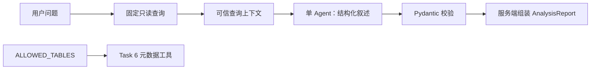

# Task 6 和 Task 8：元数据工具与结构化 Agent 设计

## 目标

交付两个可独立验证的 MVP 能力：受服务器白名单约束的 MySQL 元数据发现工具，以及基于 OpenAI Agents SDK 和 MiniMax 的单 Agent 结构化报告生成。Task 7 的动态 SQL 安全策略和受限执行不在本次范围内。

## 范围与边界

- Task 6 只读取 `ALLOWED_TABLES` 中明确配置的表，通过 SQLAlchemy Inspector 返回表名、注释、列名、类型、可空性和注释。
- Task 8 的 Agent 不注册工具、不生成或执行动态 SQL。它只基于用户问题和固定查询得到的可信查询上下文生成报告叙述与图表字段映射。
- 服务端始终保留固定查询产生的 SQL、表格、行数、截断标记、耗时与尝试次数；模型输出不能覆盖这些值。
- `MINIMAX_API_KEY` 缺失时，任务以 `PROVIDER_NOT_CONFIGURED` 失败；不回退到固定报告。
- 模型、原始响应、异常堆栈、API 密钥和隐藏表元数据均不返回浏览器。

## 架构

`Settings.allowed_tables` 是唯一授权来源。`app.database.metadata` 只对其中的表使用 SQLAlchemy Inspector；`app.tools.list_tables` 和 `app.tools.get_table_schema` 是无副作用的 Pydantic 类型化包装器。未知表始终返回 `TABLE_NOT_AVAILABLE`，不会检查或暗示该表是否在数据库中存在。

Task 8 在运行固定查询后，将可信结果作为上下文输入一个 `output_type=ReportNarrative` 的单 Agent。通过 `AsyncOpenAI(base_url=MINIMAX_BASE_URL)` 和 Agents SDK 的 `OpenAIChatCompletionsModel` 调用 MiniMax 的 OpenAI 兼容 Chat Completions API。默认模型为 `MiniMax-M3`，默认国际端点为 `https://api.minimax.io/v1`。Agent 只能生成 `title`、`summary`、`chart`、`assumptions` 和 `warnings`；服务端将这些字段与可信查询数据组装为最终 `AnalysisReport`。无效结构化输出成为 `INVALID_REPORT`，供应商调用失败成为 `PROVIDER_ERROR`。

Task 6 工具暂不注册给 Agent；Task 9 才接入。Task 7 之前不存在模型 SQL 的执行路径。

## 验证

- 元数据工具使用 fake inspector 测试白名单、稳定顺序、列属性与隐藏表错误。
- Agent runner 使用 fake runner 测试，不联网且不读取 API key。
- 缺失凭据、供应商异常与无效结构化输出必须成为脱敏的失败任务。
- 可选 live smoke test 只在显式环境变量和有效 API key 存在时运行。
