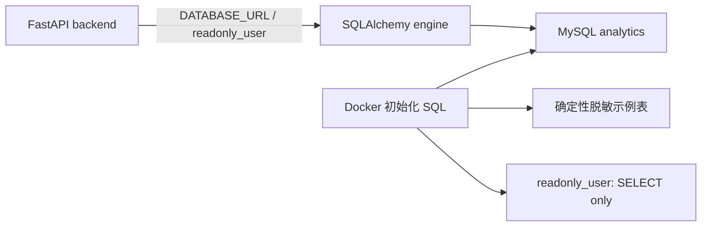

# Task 4：只读 MySQL 连接设计

## 目标

为 MVP 提供一个可复现的本地 MySQL 测试库。FastAPI 后端通过 SQLAlchemy 使用仅有 `SELECT` 权限的账号连接该库；数据库自身必须拒绝应用账号的写入和 DDL。

## 范围

- Docker Compose 启动 MySQL 8.4，并在首次初始化时创建确定性、脱敏的销售示例数据。
- 初始化脚本创建 `readonly_user`，仅授予 `analytics` schema 的 `SELECT` 权限。
- 后端提供集中创建 engine 和受管连接的数据库模块。
- `DATABASE_URL` 成为后端必填配置，使用 `SecretStr` 防止在验证错误中暴露连接串。
- 集成测试连接真实容器，验证 `SELECT` 成功且 `INSERT`、`DROP` 被 MySQL 拒绝。

## 非目标

- 不在本任务执行模型生成的 SQL、表白名单检查、行数限制、查询超时策略或 SQL 自动修复。
- 不修改任务 2 的固定报告，也不接入 Agent。
- 不支持外部数据库、多数据源、迁移框架或生产数据库配置。

## 架构

`app.database` 是唯一负责 engine 创建和连接生命周期的模块。未来的元数据服务、固定查询和 SQL 执行服务都只能依赖该模块，不能自行拼接连接串或创建裸连接。

## 安全与失败处理

- 前端永远不接收数据库连接串或凭据。
- `Settings` 使用 `SecretStr` 保存连接串；配置验证错误不打印秘密值。
- MySQL 账号不拥有 `INSERT`、`UPDATE`、`DELETE`、`CREATE`、`ALTER`、`DROP` 或管理权限。
- 连接在 `with` 作用域结束时关闭；连接建立或 SQL 执行失败由调用方在未来任务映射为安全的 API 错误，Task 4 不暴露 HTTP 数据库接口。

## 验证

- 单元测试验证 engine 使用传入的连接串并由上下文管理器关闭连接。
- `pytest -m integration` 在 Docker MySQL 上验证示例数据可读、写入和 DDL 被拒绝。
- `docker compose config` 验证服务编排和后端对 MySQL 健康检查的依赖。
